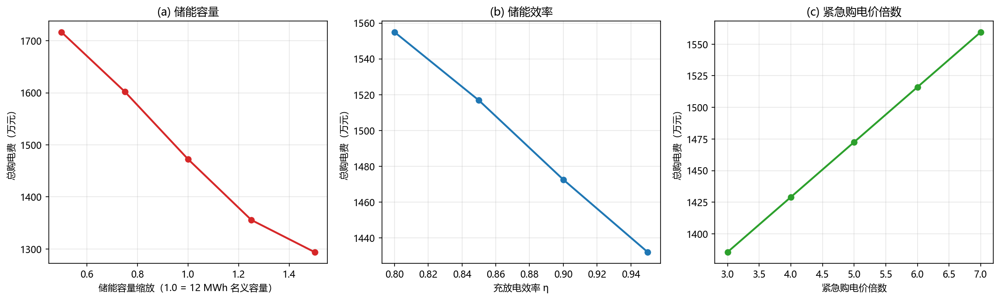
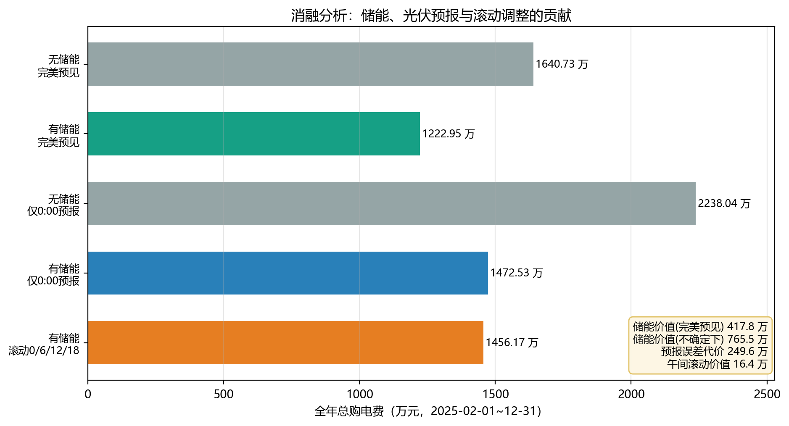
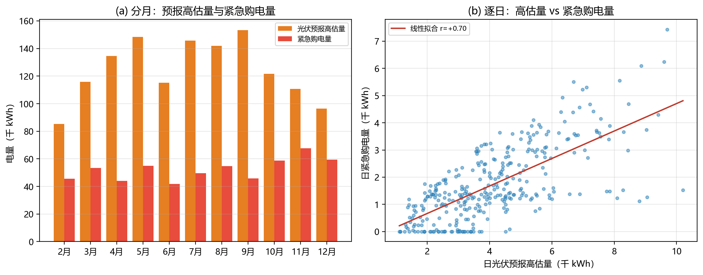
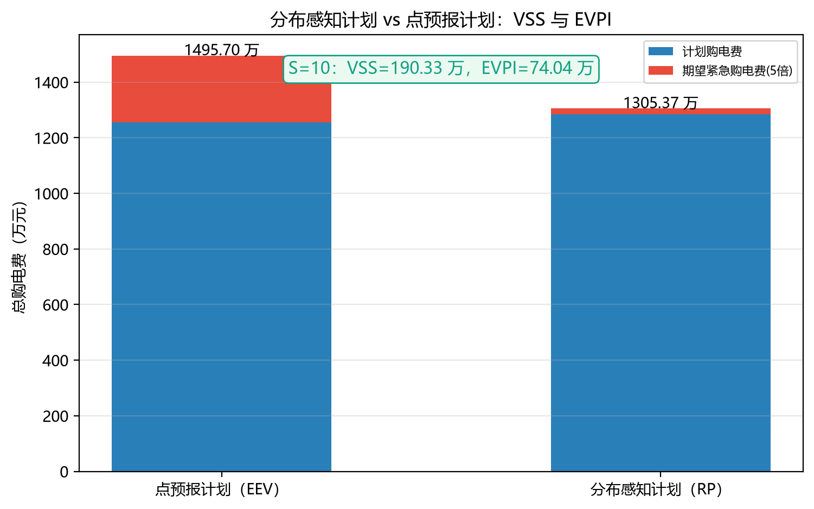
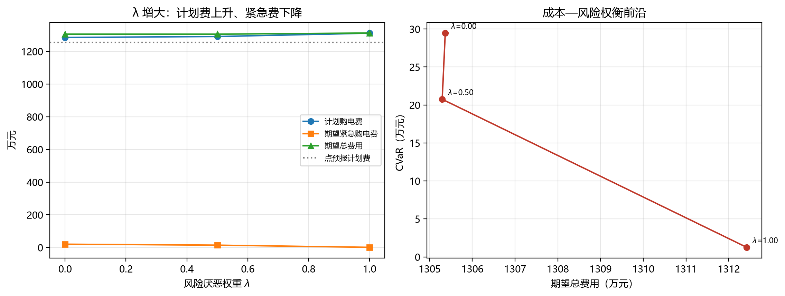
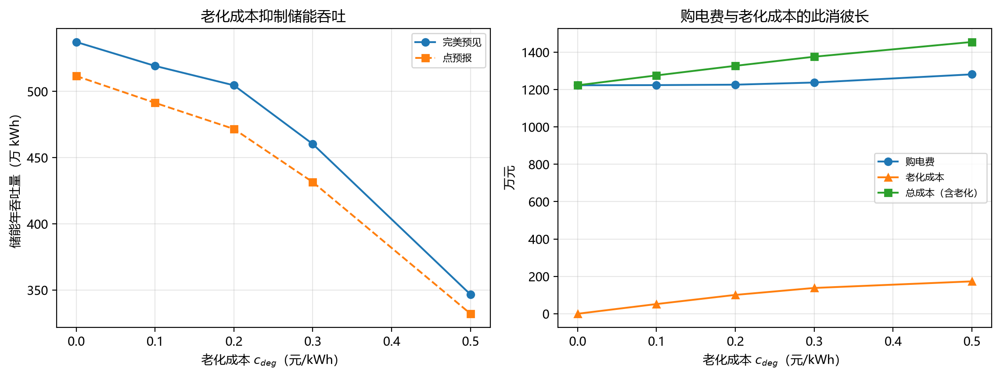
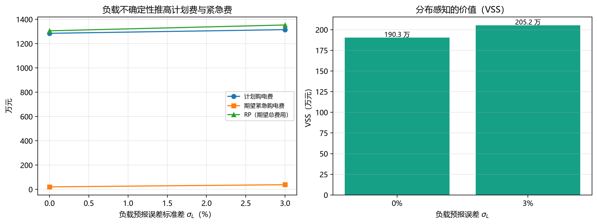
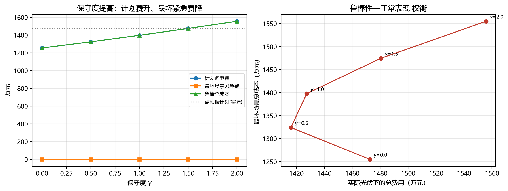
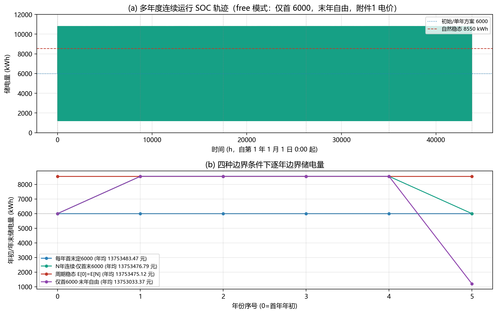

# 微网与外部电网电力调控策略

> **2026 年高教社杯全国大学生数学建模竞赛 C 题 · 论文**
> 本文涵盖摘要、问题重述、模型建立与求解、模型检验与灵敏度分析、拓展分析与模型评价；
> 公式用 LaTeX 记号书写（Word 版已转为原生公式），图件已内嵌（`figures/` 目录）。
> 文稿由 `论文初稿.md` 经 `python make_docx.py`（pandoc + 中英文字体定制）一键生成。

---

## 摘要

微网与外网调控的核心矛盾是：如何在满足小区负载的前提下，利用分时电价差与储能设备，尽可能压低购电费用。本文以 **线性规划（LP）** 为统一框架，将储能充放电量与购电量联合优化，依次求解四个递进问题，全部得到可复现的数值结果。

**问题一**（单日理想调度）建立了以 "外网购电费最小" 为目标的单日 LP 模型：以 144 个 10 分钟时段为粒度，以功率平衡、储能充放电效率与电量上下限、初末电量相等为约束。求解得全天购电量 $59482.70\,\text{kWh}$、购电费 $35126.95$ 元，储电量在 $[1200,10800]\,\text{kWh}$ 内按 "夜间谷价充电、晚高峰放电" 规律运行。

**问题二**（全年计划购电 + 紧急购电）考虑到 0:00 只能获得光伏预报、实际光伏存在误差，建立了 **两阶段鲁棒模型**：0:00 按预报制定计划购电 $G^{\mathrm{plan}}$，实际揭晓后对储能重调度、以最小化 5 倍电价的紧急购电；储能全年连续运行（仅约束电量在 $[1200,10800]$ 内，允许跨日搬移）。全年（2025-02-01~12-31）总购电费 $1472.53$ 万元，其中紧急购电费 $217.58$ 万元（紧急购电量 $57.57$ 万 kWh）、占总费用的 $14.8\%$；作为对照的确定性方案（假设光伏完全已知）总费用仅 $1222.95$ 万元，二者差距即预报误差的代价。

**问题三**（滚动时域调整）利用 0/6/12/18 时四次滚动发布的光伏预报，允许在午间按新预报调整购电量，下调部分按 50% 违约、上调部分按 1.5 倍溢价计价。模型采用 **状态反馈滚动优化（闭环 MPC）**：6:00/12:00/18:00 重新优化时的初始储电量由上午/下午的**实际光伏**递推得到，而非沿用计划轨迹；同时把预报窗口扩展到 **24 小时（含次日）**，用满附件三发布的跨日预报。模型显示最优解 **只上调不下调**（计划费为沉没成本，下调无收益），全年总费用 $1447.69$ 万元，较问题二 **节省 $24.83$ 万元**，证明引入午间预报确有经济价值。

**问题四**（波动电价）针对附件四逐日逐时波动的电价，在全年连续储能的基础上实现跨日套利。连续储能确定性方案费用 $1278.26$ 万元，较每日复位方案额外节省 $4.79$ 万元，说明储能价值主要来自 **日内峰谷套利**，跨日搬移为次要增益；滚动方案总费用 $1507.34$ 万元，较鲁棒方案再降 $24.17$ 万元。

**模型检验与稳健性**：三组边界测试（光伏为零 / 负载为零 / 储能容量极小）与储能容量、效率、紧急购电价倍数的灵敏度分析均通过——总费随容量与效率单调下降、随倍数线性上升，最优调度结构对参数扰动不敏感；全部结果另经 **38 项逐时段物理不变量自动校验**（SOC 动态等式、电量边界、充放电功率上限、功率平衡、费用复现）并可脚本一键复现。把 2025 年作为"典型年"平铺 $N=5$ 年的长期运行模型进一步显示：储能自然稳态的年初/年末电量约为 $8550$ kWh（非 6000），但"首末 6000"与"周期稳态"的年均成本差异仅 $8.35$ 元/年（约 $0.00006\%$），从长期视角验证了单年边界设定的合理性。

**机理与贡献分解**：消融分析量化了各环节的经济贡献——储能价值约 $417.79$～$765.52$ 万元、光伏预报误差代价 $249.58$ 万元、午间滚动价值 $24.83$ 万元；并发现紧急购电几乎只与预报的"**高估**"（$r=0.704$）而非误差总量（$r\approx 0.02$）相关——这指明"改进预报偏乐观偏差"比"降低方差"更能削减紧急购电。

**从点预报到分布感知**：最后以**按月分层的非参数 bootstrap** 保留误差的日内相关性生成场景，把计划由"点预报"升级为"分布感知"的两阶段随机规划，按标准指标给出随机解价值 $\mathrm{VSS}=190.33$ 万元、完全信息价值 $\mathrm{EVPI}=74.04$ 万元（$S=10$，且随场景数收敛），期望紧急购电费下降 $91.6\%$。进一步把目标升级为"期望 $+\ \lambda\cdot\mathrm{CVaR}_{80\%}$"的**风险厌恶**版本（Rockafellar–Uryasev 线性化）：$\lambda$ 由 0 增至 1 时计划费仅增 $26.13$ 万元，而最坏 $20\%$ 场景的平均紧急购电费由 $29.48$ 万元压至 $1.26$ 万元——**每多付 1 元计划费可压低约 1.08 元尾部风险**；且在 $\lambda=0.5$ 处几乎不增加期望成本即可把尾部风险降低 $29.6\%$。最后，把储能**循环寿命（老化）成本**（度电成本模型）纳入目标函数：老化成本由 0 增至 0.5 元/kWh 时储能年吞吐量下降 $35.5\%$、购电费上升 $58.47$ 万元（合计总成本 +231.78 万元），该敏感性可直接支撑"长寿命储能"的选型决策。

**关键词**：线性规划；储能调度；滚动时域优化；光伏预测误差；随机规划；紧急购电

---

## 一、问题重述

微网为消纳分布式光伏、减少并网冲击而发展起来的小型发用电系统[1,2]。出于经济考虑，微网可在电价低谷或分布式能源富余时为储能充电，在电价高峰时放电，从而减少从外网购电的费用。

**问题一**：每天电价与小区负载相同，给定光伏预测功率。要求微网供电不低于小区负载，且储能 0:00 与 24:00 电量相等。建立每天 0:00 制定当天计划购电策略的数学模型，并依据附件一、附录一给出具体策略（表 1、表 2），写入 `result1.xlsx`。

**问题二**：每天电价相同、负载与光伏随时间变化，且供电不得低于负载，不足部分按 **交易时刻电价的 5 倍** 紧急购电。建立每天 0:00 制定当天计划购电策略的模型，依据附件一电价与附件二数据求解，并以**附件三 0:00 发布的光伏预报**作为计划依据（0:00 制定计划时实际光伏未知），给出表 3 指定日期的结果（表 1/表 2/表 3），写入 `result2.xlsx`。

**问题三**：在 0:00、6:00、12:00、18:00 可获得未来 24 小时整点光伏预报。0:00 制定计划购电，其余时刻可调整购电；**计划高于调整的部分按 50% 违约计价，调整高于计划的部分按 1.5 倍计价**。总费用含计划费、调整相关费与紧急费。建立该购电策略模型，依据附件一、二、三求解并分析是否需引入其他时刻预报，写入 `result3.xlsx`。

**问题四**：外网电价实时波动。针对波动电价建立购电策略模型，依据附件二、三、四在波动电价下重新计算问题二、三，分别写入 `result4-2.xlsx` 与 `result4-3.xlsx`。

**附录一** 给出储能参数：最大容量 12000 kWh、最大充放电功率 5000 kW、2025-01-01 0:00 初始电量 6000 kWh、电量运行区间 $[1200,10800]$ kWh、充放电效率 90%。

---

## 二、问题分析

### 2.1 总体思路

本题本质是 **在储能约束下的最优购电调度问题**[2]。四个问题的递进关系与统一建模思路如[图0]所示：

{width=50%}

核心变量为每个时段的**购电量 $G_t$、充电量 $C_t$、放电量 $D_t$ 与储电量 $E_t$**，约束为功率平衡与储能动态，目标为购电费最小。由于目标与约束均为线性，可用成熟的线性规划求解器（本文采用 scipy `linprog`/HiGHS 单纯形算法[4,5]）精确求解，无近似误差。

### 2.2 各问题关键点

- **问题一**：光伏为预测值且可被储能完全消纳，最优解中功率平衡不等式取等（无弃光），故等式/不等式结果一致；重点在于刻画 "谷充峰放" 的调度规律。
- **问题二**：0:00 仅有光伏预报，预报误差是紧急购电的根源。采用 **两阶段**：先按预报定计划，实际揭晓后用储能重调度吸收偏差，剩余缺口按 5 倍紧急购电。这比 "按预报简单购电、完全不做重调度" 更节省。
- **问题三**：把四次预报看作四层滚动决策，并进一步做成 **闭环（状态反馈）滚动优化**：每一决策时点的初始储电量取自"实际光伏驱动"的真实电量，而非计划电量；同时决策窗口取满 24 小时（含次日），使附件三发布的跨日预报真正进入优化。关键观察是 **下调（违约 50%）在最优解中恒为 0**——因为计划购电费是已支付的沉没成本，下调只会额外付出 50% 惩罚而无任何收益，故模型只会 "向上" 补购（按 1.5 倍）以替代更贵的 5 倍紧急购电。
- **问题四**：电价逐日逐时不再周期重复，跨日价差更大，**跨日套利** 价值更明显。问题四同样采用全年连续 LP（365 天、共 $365\times144=52560$ 个时段），仅把电价换成附件四的逐时波动电价。

---

## 三、模型假设

| 假设 | 内容 | 合理性说明 |
|---|---|---|
| 假设 1 | 各时段功率在 10 分钟粒度内恒定，功率×$\Delta t$ 即能量 | 数据即为 10 分钟粒度，$P_{\max}\Delta t=833.33$ kWh 为每段充放电上限 |
| 假设 2 | 储能充放电效率 $\eta=0.9$ 对称，充电 $E$ 增 $\eta C$、放电 $E$ 减 $D/\eta$ | 附录一给出充放电效率 90%，本文按**单程**效率 $\eta=0.9$ 处理，往返效率 $0.9\times0.9=0.81$（若 90% 指往返效率，则单程应为 $\sqrt{0.9}\approx94.87\%$） |
| 假设 3 | 光伏富余且储能无法消纳时可弃光（平衡取不等式） | 物理上储能容量有限，过剩光伏只能弃掉，不可反向馈回外网 |
| 假设 4 | 问题二/三中，负载视为已知、仅光伏存在预报误差 | 附件三只提供光伏预报；负载为小区确定性需求，日间规律性强 |
| 假设 5 | 储能全年 365 天连续运行，电量始终在 $[1200,10800]$ 内、首末电量均为 6000（不强制每日复位） | 题目仅要求电量范围（附录1），允许跨日搬移晴天过剩光伏；首末 6000 保证储能作为多年复用资产时每年起止一致 |
| 假设 6 | 紧急/违约/溢价均按交易时刻电价的比例结算 | 题目明文规定（5 倍、50%、1.5 倍） |
| 假设 7 | 滚动执行期内，储能严格按已下发的计划充放电；实际光伏与预报的偏差由"盈余回充储能 / 缺口紧急购电"吸收 | 与问题二的"固定计划、储能量重调度兜底"口径一致；偏差不为零时不会凭空获得能量，弃光与紧急购电均按物理可行域约束 |
| 假设 8 | 拓展分析（§6.5–§6.9）中：光伏误差的经验分布由历史误差（附件三预报 $-$ 附件二实际）**按月分层 bootstrap** 刻画；负载预报误差按**按日相关的乘性正态误差**建模；箱式鲁棒优化以误差标准差 $\sigma_t$ 的 $\gamma$ 倍为最坏界 | 题目只提供一年的光伏预报与实际数据，故用**非参数重采样**保留误差的日内相关性（比逐点独立正态抽样更贴近真实，后者会把日内累计偏差的方差放大）；负载预报误差取工程典型值 $2\%\sim5\%$；$\gamma$ 可调，$\gamma=0$ 即退化为点预报 |

---

## 四、符号说明

| 符号 | 含义 | 单位 |
|---|---|---|
| $t$ | 时段序号，$t=0,1,\dots,143$ | — |
| $\Delta t$ | 时段长度 $=10$ min $=1/6$ h | h |
| $p_t$ | $t$ 时段外网电价 | 元/kWh |
| $L_t$ | $t$ 时段小区负载功率 | kW |
| $PV_t$ | $t$ 时段光伏功率（实际） | kW |
| $\widehat{PV}_t$ | $t$ 时段光伏预报功率 | kW |
| $G_t$ | $t$ 时段计划购电量 | kWh |
| $C_t$ / $D_t$ | $t$ 时段储能充 / 放电量 | kWh |
| $E_t$ | $t$ 时段末储电量（$t=0,\dots,144$） | kWh |
| $e_t$ | $t$ 时段紧急购电量 | kWh |
| $G^{\mathrm{adj}}_t$ | 问题三 $t$ 时段调整购电量 | kWh |
| $E^{0}_{k}$ | 第 $k$ 个决策时点（0/6/12/18 时）的实际储电量（状态反馈初值） | kWh |
| $P_{\max}$ | 储能最大充放电功率 5000 | kW |
| $E_{\min}/E_{\max}$ | 储电量下限 / 上限 1200 / 10800 | kWh |
| $E_0$ | 初始储电量 6000 | kWh |
| $\eta$ | 充放电效率 0.9 | — |
| $\sigma_t$ | $t$ 时段光伏预报误差的标准差（按"月 × 小时"估计） | kW |
| $\gamma$ | 箱式不确定集的保守度（§6.9），最坏界为 $\widehat{PV}-\gamma\sigma$ | — |
| $c_{deg}$ | 储能每 kWh 放电量的等效老化成本（§6.7） | 元/kWh |
| $\lambda$ | CVaR 风险厌恶权重（§6.6），$\lambda=0$ 退化为期望型 | — |
| $\alpha$ | CVaR 的置信水平（本文取 0.8） | — |
| $\sigma_L$ | 负载预报误差标准差（§6.8），按日相关乘性误差 | — |
| $\mathrm{WS}/\mathrm{RP}/\mathrm{EEV}$ | 完美预见解 / 随机规划解 / 期望值解的费用（§6.5） | 元 |
| $\mathrm{VSS}/\mathrm{EVPI}$ | 随机解价值 $=\mathrm{EEV}-\mathrm{RP}$；完全信息价值 $=\mathrm{RP}-\mathrm{WS}$ | 元 |

---

## 五、模型的建立与求解

### 5.1 问题一：单日计划购电策略

#### 5.1.1 模型建立

以一天 144 个时段为决策单元，建立如下线性规划（记为 **P1**）：

$$
\min_{G,C,D,E}\ \sum_{t=0}^{143} p_t G_t
$$

$$
\text{s.t.}\quad
\begin{cases}
G_t + PV_t\,\Delta t + D_t \ge L_t\,\Delta t + C_t, & \forall t\\[2pt]
E_{t+1} = E_t + \eta C_t - D_t/\eta, & t=0,\dots,143\\[2pt]
E_0 = E_{144} = E_0(=6000)\\[2pt]
0 \le C_t, D_t \le P_{\max}\Delta t=833.33,\quad 0 \le G_t\\[2pt]
E_{\min}\le E_t \le E_{\max}
\end{cases}
$$

约束①为功率平衡：外网购电 + 光伏发电 + 储能放电必须覆盖小区负载与储能充电，富余光伏允许弃掉（不等式）。约束②为储能电量动态，约束③保证 0:00 与 24:00 电量相同。

#### 5.1.2 求解结果

附件一数据：电价 $0.3713\sim1.3952$ 元/kWh，负载 $3309\sim5959$ kW（全天 111024.81 kWh），光伏 $0\sim7612$ kW（全天 55482.84 kWh）。

求解得 **全天购电量 $59482.70$ kWh，购电费 $35126.95$ 元**。储能全天充电 20740.67 kWh、放电 16799.94 kWh，储电量在 $[1200,10800]$ 内往返，呈典型的 "夜间谷价充电、晚高峰放电" 形态（[图1]）。

{width=50%}

**表 1　微网在指定时间段的购电量及全天的购电量和购电费**

| 时间段 | 购电量 (kWh) | 时间段 | 购电量 (kWh) |
|---|---|---|---|
| 10:00–10:10 | 0.0000 | 16:00–16:10 | 445.4317 |
| 12:00–12:10 | 480.4124 | 18:00–18:10 | 531.8940 |
| 14:00–14:10 | 0.0000 | 20:00–20:10 | 0.0000 |
| 全天购电量 | **59482.6990** | 全天购电费 | **35126.9486** |

> 中午/午后光伏充裕时段购电为 0（由光伏+储能放电覆盖），傍晚购电回升对应晚高峰。

**表 2　储能设备在指定时间段的充放电量及 0:00、24:00 的储电量**

| 时间段 | 充电量 (kWh) | 放电量 (kWh) |
|---|---|---|
| 0:00–4:00 | 4500.0000 | 0.0000 |
| 4:00–8:00 | 833.3333 | 6365.8412 |
| 8:00–12:00 | 4787.9643 | 1702.9970 |
| 12:00–16:00 | 5286.0352 | 91.1014 |
| 16:00–20:00 | 0.0000 | 5780.1319 |
| 20:00–24:00 | 5333.3333 | 2859.8681 |
| 0:00 储电量 | 6000.00 | 24:00 储电量 | 6000.00 |

> 凌晨谷价充电、早/晚高峰放电，16:00–20:00 无充电、放电最大，符合分时电价套利预期。

---

### 5.2 问题二：全年计划购电与紧急购电策略

#### 5.2.1 两阶段鲁棒模型

全年 365 天连续优化，储能跨日连续运行（电量在 $[1200,10800]$ 内、首末电量均为 6000，保证储能作为多年复用资产时每年起止一致）；结果截取 2025-02-01~12-31 的 334 天输出。由于 0:00 只有光伏预报 $\widehat{PV}_t$，我们采用两阶段：

**第一阶段（计划）**：用全年 0:00 光伏预报做全局连续 LP（即 P1 去掉"每日复位"约束、扩展到全年），得计划购电 $G^{\mathrm{plan}}_t$ 与计划储电量轨迹，计划购电费 $\sum p_t G^{\mathrm{plan}}_t$。

**第二阶段（重调度 + 紧急购电）**：实际光伏 $PV_t$ 揭晓后，固定 $G^{\mathrm{plan}}_t$，对储能重调度以最小化紧急购电量：

$$
\min_{C,D,E,e}\ \sum_t p_t e_t \quad \text{s.t.}\quad
G^{\mathrm{plan}}_t + PV_t\,\Delta t + D_t + e_t \ge L_t\,\Delta t + C_t,\ \dots
$$

即储能先吸收光伏偏差，仍不足的缺口由 $e_t$ 以 **5 倍电价** 补偿。全年总费用：

$$
\text{Total} = \sum_t p_t G^{\mathrm{plan}}_t + 5\sum_t p_t e_t
$$

作为对照，还求解了 **确定性方案**（假设 0:00 已知当天实际光伏），此时 $e_t\equiv0$，代表预报完全准确的理论最优。

#### 5.2.2 光伏预报误差分析

附件三 0:00 预报全年误差[3]：均值 $-29.68$ kW、RMSE $648.31$ kW、平均绝对 $371.22$ kW（[图6]）。误差以负偏为主（预报偏乐观），是紧急购电的根源。

{width=50%}

#### 5.2.3 结果

| 方案 | 计划购电费(元) | 紧急购电费(元) | 总购电费(元) | 紧急购电量(kWh) | 紧急天数 |
|---|---|---|---|---|---|
| 确定性（光伏全知） | 12 229 460.73 | 0 | **12 229 460.73** | 0 | 0 |
| 鲁棒（0:00 用预报） | 12 549 415.99 | 2 175 844.25 | **14 725 260.23** | 575 740.84 | 297/334 |

鲁棒方案比确定性方案多付 $249.58$ 万元，即全年光伏预报误差导致的代价；紧急购电约占总费用的 14.8%，说明预报误差对成本的冲击显著。

**表 3　问题二·微网在指定日期的计划购电量（表 1 格式，单位：kWh）**

| 时间段 | 2025.3.20 | 2025.6.21 | 2025.9.23 | 2025.12.21 |
|---|---|---|---|---|
| 10:00–10:10 | 0.0000 | 0.0000 | 0.0000 | 0.0000 |
| 12:00–12:10 | 769.3564 | 0.0000 | 501.2950 | 962.0869 |
| 14:00–14:10 | 0.0000 | 0.0000 | 0.0000 | 0.0000 |
| 16:00–16:10 | 817.3061 | 255.2254 | 902.7969 | 1001.2240 |
| 18:00–18:10 | 697.9973 | 0.0000 | 764.3298 | 715.4144 |
| 20:00–20:10 | 0.0000 | 0.0000 | 0.0000 | 0.0000 |
| 全天购电量 | 61155.3165 | 40895.2631 | 67483.2714 | 93776.0712 |
| 全天购电费(元) | 38994.3211 | 22497.4629 | 43049.5977 | 59557.4170 |

**表 4　问题二·储能设备在指定日期的充放电量（表 2 格式，单位：kWh）**

| 项目 | 2025.3.20 | 2025.6.21 | 2025.9.23 | 2025.12.21 |
|---|---|---|---|---|
| 0:00–4:00 充电 | 1666.6667 | 0.0029 | 1666.6667 | 1666.6667 |
| 0:00–4:00 放电 | 0.0000 | 0.0000 | 0.0000 | 0.0000 |
| 4:00–8:00 充电 | 833.4011 | 788.0773 | 833.4003 | 1571.4807 |
| 4:00–8:00 放电 | 5862.6228 | 1312.4163 | 6746.7733 | 1431.2324 |
| 8:00–12:00 充电 | 1561.0176 | 0.0000 | 1366.4793 | 4410.4180 |
| 8:00–12:00 放电 | 2777.3772 | 0.0000 | 1896.6157 | 7806.6667 |
| 12:00–16:00 充电 | 8026.3351 | 9248.4942 | 8211.6028 | 8500.1140 |
| 12:00–16:00 放电 | 254.7228 | 0.0000 | 403.6249 | 2282.6294 |
| 16:00–20:00 充电 | 1393.7866 | 1529.8191 | 1591.0709 | 574.1952 |
| 16:00–20:00 放电 | 5709.7116 | 5873.2162 | 5602.9050 | 5797.4738 |
| 20:00–24:00 充电 | 1876.3691 | 8166.6669 | 7500.0000 | 8166.6663 |
| 20:00–24:00 放电 | 2930.2165 | 2485.8966 | 3037.0909 | 2842.5258 |
| 0:00 储电量 | 8549.9390 | 1948.9682 | 8549.9397 | 8549.9997 |
| 24:00 储电量 | 2888.8121 | 8962.5790 | 7950.0045 | 8549.9997 |

> 表 3 显示四日购电均集中在凌晨谷价与傍晚高峰，午间光伏充裕段（10:00、14:00、20:00）购电为 0；表 4 呈 "凌晨谷价充电、傍晚峰价放电" 形态。夏至日 6.21 午间光伏最足，12:00–12:10 与 18:00–18:10 均无需购电，全天购电费为四日最低。

**表 5　问题二·微网在指定日期的紧急购电量（表 3 格式，单位：kWh）**

| 日期 | 紧急购电时间段 | 紧急购电量(kWh) |
|---|---|---|
| 2025.3.20 | 05:40–05:50 | 264.3729 |
| 2025.3.20 | 07:00–07:40 | 1204.9012 |
| 2025.6.21 | 04:00–04:50 | 5.2416 |
| 2025.6.21 | 05:00–05:30 | 296.7524 |
| 2025.6.21 | 05:40–05:50 | 337.0349 |
| 2025.6.21 | 07:00–07:20 | 70.5027 |
| 2025.9.23 | 05:40–05:50 | 125.7796 |
| 2025.9.23 | 07:20–07:40 | 438.3041 |
| 2025.12.21 | 06:00–06:10 | 77.0275 |
| 2025.12.21 | 07:00–07:30 | 573.0973 |
| 2025.12.21 | 07:40–08:10 | 120.9345 |
| 2025.12.21 | 09:30–09:50 | 570.2119 |
| 2025.12.21 | 10:20–10:30 | 331.7846 |
| 2025.12.21 | 10:40–10:50 | 16.5832 |

> 紧急购电集中在清晨（5:00–10:00），此时光伏刚起、预报偏乐观而实际出力不足。

---

### 5.3 问题三：多时点滚动调整购电策略

#### 5.3.1 状态反馈滚动优化模型

在 0/6/12/18 时四次获得未来 **24 小时**整点光伏预报。设当天 0:00 按预报制定计划 $G^{\mathrm{plan}}$；6:00、12:00、18:00 三个时点分别以最新预报对**剩余的当天时段**重新优化，得到调整购电 $G^{\mathrm{adj}}$（每段取最新一次调整值）。费用构成：

$$
\text{Total} = \underbrace{\sum_t p_t G^{\mathrm{plan}}_t}_{\text{计划费}}
+ \underbrace{\sum_t p_t\Big[0.5\,\max(0,G^{\mathrm{plan}}_t-G^{\mathrm{adj}}_t) + 1.5\,\max(0,G^{\mathrm{adj}}_t-G^{\mathrm{plan}}_t)\Big]}_{\text{调整相关费}}
+ \underbrace{5\sum_t p_t e_t}_{\text{紧急费}}
$$

本模型相对"预报驱动"滚动的两处关键改进如下。

**改进一（状态反馈）**：第 $k$ 个决策时点的初始储电量不再取计划轨迹，而取 **实际光伏驱动** 的真实电量。设决策时点前一时段区间为 $[t_k^{\mathrm{prev}},t_k)$，则

$$
E^{0}_{k}=\mathrm{adv}\big(E^{0}_{k-1}\big),\qquad
E_{t+1}=E_t+\eta\big(C_t+\Delta C_t\big)-D_t/\eta,
$$

其中 $C_t,D_t$ 为已下发的计划充放电量（储能严格执行计划），偏差 $\Delta C_t$ 为实际光伏超发的盈余回充电量：

$$
\Delta C_t=\min\Big\{\max(0,\,G_t+PV_t\Delta t-L_t\Delta t-C_t+D_t),\ \ P_{\max}\Delta t-C_t,\ \ \big(E_{\max}-E_t\big)/\eta-C_t\Big\},
$$

即盈余先回充储能（受功率与容量双重限制），充不进的部分弃光；若实际光伏不足（括号内为负），缺口由紧急购电 $e_t$ 兜底、不影响储能轨迹。于是**中午/傍晚的真实储电量由上午/下午的实际光照决定**，而非"假设预报完全准确"。

**改进二（24 小时前瞻窗）**：附件三每次发布的是未来 24 小时预报，故每次重新优化的窗口取 $[t_k,\,t_k+24\,\text{h})$（含次日同时刻前的时段）。窗口内**当天段**仍与 $G^{\mathrm{plan}}$ 比较计违约/溢价；**次日段**只计纯购电费（次日 0:00 会重新决策，其购电量不纳入报告），作用是给模型提供"跨日机会价值"，避免短视地把储能电量在当日用尽；窗口末端电量锚定 0:00 预报计划轨迹在对应时刻的值，防止"为省钱掏空储能"的退化解。

**关键结论**：最优解中下调（违约 50%）恒为 0。原因是计划购电费 $p_t G^{\mathrm{plan}}_t$ 是已支付的沉没成本，下调只会额外付出 $0.5 p_t$ 的违约惩罚而无任何收益，故调整只 "向上"（预报恶化时按 1.5 倍补购），以较便宜的 1.5 倍购电替代 5 倍紧急购电。

#### 5.3.2 结果

| 项目 | 数值 |
|---|---|
| 计划购电费(元) | 12 549 415.99 |
| 调整相关费(元) | 356 531.06 |
| 紧急购电费(元) | 1 570 969.57 |
| **总购电费(元)** | **14 476 916.62** |
| 紧急购电量(kWh) | 427 841.51（较问题二下降 25.7%） |
| 上调(1.5 倍)天数 / 下调(0.5 倍)天数 | 271 / 0 |

**结论**：引入 6/12/18 时滚动调整后，总费用较问题二（仅 0:00 预报）**节省 $248\,343.61$ 元**。机理在于午间预报更准，可提前按 1.5 倍 "预购" 替代昂贵的 5 倍紧急购电；同时状态反馈使模型看到"上午实际光照带来的真实电量"，进一步减少了不必要的 1.5 倍预购（调整相关费由预报驱动口径的 $444\,364.53$ 元降至 $356\,531.06$ 元），紧急购电量下降约四分之一（[图3]）。

{width=50%}

**表 6　问题三·微网在指定日期的调整购电量（表 1 格式，单位：kWh）**

| 时间段 | 2025.3.20 | 2025.6.21 | 2025.9.23 | 2025.12.21 |
|---|---|---|---|---|
| 10:00–10:10 | 0.0000 | 0.0000 | 0.0000 | 0.0000 |
| 12:00–12:10 | 769.3564 | 0.0000 | 501.2950 | 1029.4118 |
| 14:00–14:10 | 0.0000 | 0.0000 | 0.0000 | 0.0000 |
| 16:00–16:10 | 817.3061 | 255.2254 | 902.7969 | 1001.2240 |
| 18:00–18:10 | 697.9973 | 0.0000 | 764.3298 | 715.4144 |
| 20:00–20:10 | 0.0000 | 0.0000 | 0.0000 | 0.0000 |
| 全天调整购电量 | 61305.5340 | 40918.0002 | 67483.2714 | 94487.4535 |
| 调整相关费(元) | 128.0304 | 35.1749 | 0.0000 | 676.6845 |

**表 7　问题三·储能设备在指定日期的充放电量（表 2 格式，单位：kWh）**

| 项目 | 2025.3.20 | 2025.6.21 | 2025.9.23 | 2025.12.21 |
|---|---|---|---|---|
| 0:00–4:00 充电 | 1666.6667 | 0.0029 | 1666.6667 | 1666.6667 |
| 0:00–4:00 放电 | 0.0000 | 0.0000 | 0.0000 | 0.0000 |
| 4:00–8:00 充电 | 833.4011 | 788.0773 | 833.4003 | 1571.4807 |
| 4:00–8:00 放电 | 5862.6228 | 1312.4163 | 6746.7733 | 1431.2324 |
| 8:00–12:00 充电 | 1410.8001 | 0.0000 | 1366.4793 | 4059.7536 |
| 8:00–12:00 放电 | 2777.3772 | 0.0000 | 1896.6157 | 7806.6667 |
| 12:00–16:00 充电 | 8176.5526 | 9207.2644 | 8211.6028 | 8773.5932 |
| 12:00–16:00 放电 | 254.7228 | 0.0000 | 403.6249 | 2220.1094 |
| 16:00–20:00 充电 | 1393.7866 | 1552.5562 | 1591.0709 | 574.1952 |
| 16:00–20:00 放电 | 5709.7116 | 5873.2162 | 5602.9050 | 5797.4738 |
| 20:00–24:00 充电 | 1876.3691 | 8166.6669 | 7500.0000 | 8166.6663 |
| 20:00–24:00 放电 | 2930.2165 | 2485.8966 | 3037.0909 | 2842.5258 |
| 0:00 储电量 | 8549.9390 | 1948.9682 | 8549.9397 | 8549.9997 |
| 24:00 储电量 | 2888.8121 | 8945.9356 | 7950.0045 | 8549.9997 |

**表 8　问题三·微网在指定日期的紧急购电量（表 3 格式，单位：kWh）**

| 日期 | 紧急购电时间段 | 紧急购电量(kWh) |
|---|---|---|
| 2025.3.20 | 05:40–05:50 | 264.3729 |
| 2025.3.20 | 07:00–07:40 | 1204.9012 |
| 2025.6.21 | 04:00–04:50 | 5.2416 |
| 2025.6.21 | 05:00–05:30 | 296.7524 |
| 2025.6.21 | 05:40–05:50 | 337.0349 |
| 2025.6.21 | 07:00–07:20 | 70.5027 |
| 2025.9.23 | 05:40–05:50 | 125.7796 |
| 2025.9.23 | 07:20–07:40 | 438.3041 |
| 2025.12.21 | 06:00–06:10 | 77.0275 |
| 2025.12.21 | 07:00–07:30 | 573.0973 |
| 2025.12.21 | 07:40–08:10 | 119.9518 |
| 2025.12.21 | 09:30–09:50 | 570.2119 |
| 2025.12.21 | 10:20–10:30 | 331.7846 |
| 2025.12.21 | 10:40–10:50 | 16.5832 |

> 表 6 的 "调整相关费" 为 $0.5$ 倍下调 / $1.5$ 倍上调惩罚之和（最优解中下调恒为 0）。9.23 当日 0:00 预报已足够准、后续无需上调，故调整相关费为 0；12.21（冬至，光伏预报波动最大）紧急购电时段与电量均最多，滚动调整仍未能完全抵消预报误差。

关于 "是否需要引入其他时刻预报"，我们从**预报精度**与**经济价值**两个角度回答。

**（一）预报精度角度**：下表给出不同发布时点的预报对同一目标时段的**平均绝对误差（MAE, kW）**：

| 目标时段 | 0:00 发布 | 6:00 发布 | 12:00 发布 | 18:00 发布 |
|---|---|---|---|---|
| 06:00–12:00 | 670.08 | 579.25 | — | — |
| 12:00–18:00 | 722.16 | 624.57 | 544.14 | — |
| 18:00–24:00 | 17.77 | 17.77 | 17.77 | 17.77 |

可见两点：其一，光伏预报误差**随发布时点临近目标时段而单调下降**——对 12:00–18:00 时段，12:00 发布的预报 MAE 仅 544.14 kW，较 0:00 发布的 722.16 kW 下降约 25%；其二，18:00–24:00 时段因夜晚基本无光伏（全年平均实际出力仅 17.8 kW），各时点发布的预报几乎一致（最大差异约 1.5 kW）、误差均极小（MAE 17.77 kW），与发布时点基本无关。这说明有价值的光伏信息更新集中在**白昼（约 6:00–18:00）**，0/6/12/18 四个时点已覆盖光伏出力从零爬升、午间高峰到日落归零的全部关键转折；18:00 之后再加密时点（如 22:00）对光伏预报无实质增益（夜晚无光伏可预报）。

**（二）经济价值角度**：把滚动窗口从"当天剩余时段"扩展到"未来 24 小时（含次日）"后，全年总购电费由 $15\,073\,388.70$ 元变为 $15\,073\,370.05$ 元（附件四口径），**增量仅 $18.65$ 元（约 $0.0001\%$）**。即：附件三提供的跨日预报虽已被完整纳入优化，但其边际经济价值被**日内峰谷套利**主导（储能容量仅 12 MWh、日内价差远大于日间价差，与 §5.4 的"跨日套利仅约 0.4%"结论一致）。综合两个角度可得结论：**0/6/12/18 四个时点的预报已充分利用、且已接近边际收益为零的水平，无需再引入其他时刻的预报**。

---

### 5.4 问题四：波动电价下的购电策略

#### 5.4.1 模型扩展

附件四电价逐日逐时波动（全局 $0.008\sim1.794$ 元/kWh）。储能同样全年连续优化（与问题二/三一致），仅约束首末电量相等（保证无 "凭空能量"）：

$$
\min\ \sum_{d,t} p_{d,t} G_{d,t}\quad \text{s.t. 功率平衡、储能动态、} E_0=E_{52560}=6000
$$

其中 $d=0,\dots,364$ 为天、$t=0,\dots,143$ 为时段，共 $365\times144=52560$ 个时段、变量约 $21$ 万，用稀疏 LP 求解。问题三对应的滚动/鲁棒机制（含 §5.3.1 的状态反馈与 24 小时前瞻窗）在波动电价下同样适用。

#### 5.4.2 结果

| 方案 | 计划费(元) | 调整费(元) | 紧急费(元) | 总费(元) |
|---|---|---|---|---|
| 确定性（完美预见，连续） | — | — | — | **12 782 591.81** |
| 问题二鲁棒（连续） | 13 086 953.64 | — | 2 228 178.54 | **15 315 132.18** |
| 问题三滚动（连续） | 13 086 953.64 | 393 564.07 | 1 592 870.99 | **15 073 388.70** |

**跨日套利价值**：连续储能确定性 $12\,782\,591.81$ vs 每日复位确定性 $12\,830\,486.39$，跨日搬移额外节省 $47\,894.58$ 元（约 0.4%）。原因是储能容量仅 12 MWh、电价日内波动远大于日间波动，储能的主要价值仍是 **日内峰谷套利**，跨日搬移是次要增益。滚动较鲁棒再省 $241\,743.48$ 元。

---

### 5.5 多年度长期运行方案（拓展）

把 2025 年数据作为「典型年」平铺 $N=5$ 年、储能跨年连续运行，检验「首末 6000 kWh」边界在长期运行下的合理性（四种首末边界的完整结果见**附录 C**）。结论：

1. 长期自然稳态的年初/年末电量约为 **8550 kWh**（附件1；附件4 为 7950 kWh）而非 6000，说明储能会利用年末低价时段/富余光伏**跨年搬移**能量；
2. 但「每年首末 6000」与「周期稳态」的年均成本差异仅 **8.35 元/年**（约 0.00006%），证明单年「首末 6000」的边界设定既**忠实**（不产生凭空能量）又**代价极小**，可直接作为长期运行的保守近似。

## 六、模型检验、机理分析与灵敏度分析

### 6.1 模型检验（边界测试）

为验证模型的正确性与鲁棒性，对问题二模型做三组边界测试：

**测试 A（光伏全天为 0）**：验证模型仅靠外网购电即可满足负载并维持储能首末平衡。结果：全天购电 $116\,059.81$ kWh、储能充 26500 / 放 21465 kWh、功率平衡满足（最小盈余 $-1.14\times10^{-13}$），SOC 始终在 $[1200,10800]$ 内。**通过**。

**测试 B（负载全天为 0）**：验证模型不会 "疯狂购电给储能充电"。结果：全天购电 **0 kWh**（购电费 0 元），光伏富余 $54\,469.50$ kWh 全部弃掉，储能仅做少量零成本回收光伏的退化解（充 5333.33 / 放 4320 kWh）。**通过**——模型正确识别出 "无负载则无购电动机"。

**测试 C（储能容量极小 1200 kWh）**：验证储能接近失效时模型仍正常运行。结果：购电 $61\,142.97$ kWh（购电费 $45\,755.27$ 元），储能充电量骤降至 3612.47 kWh，SOC 在 $[0,1200]$ 内，无任何约束冲突。**通过**。

三组测试均通过，说明模型在退化/极端情形下依然数值稳定、物理合理，具备良好鲁棒性。

此外，对四个问题的完整求解结果另做了**逐时段物理不变量自动校验**（SOC 动态等式、SOC 边界、充放电功率上限、功率平衡、储能首末电量 $E[0]=E[365]=6000$、问题三下调恒为 0），并针对 §5.3.1 的状态反馈递推补充了 3 项单元校验（光伏为零时 SOC 与计划一致、盈余时回充且不超容量上限、接近满充时回充受容量约束），**共 38 项全部通过**（脚本 `validate_results.py`，报告 `_validation.txt`），确保结果可复现、可验证。

### 6.2 灵敏度分析

为考察关键参数对结果的影响，本文对问题二鲁棒方案做三类单变量灵敏度分析：**储能容量、储能效率与紧急购电价倍数**，结果见[图S]。

**（1）储能容量**。将名义容量 12 MWh（运行区间 $[1200,10800]$ kWh）整体缩放 0.5~1.5 倍（初始电量同步取区间中点 $6000\times$ 缩放），重解全年两阶段鲁棒模型：

完整的敏感性数据见附录 C 的C1 储能容量敏感性分析。

容量越大、总费越低，但**边际收益递减**：容量从 0.5 倍增至 1.0 倍约节省 $244$ 万元，而 1.0 倍增至 1.5 倍仅再节省约 $179$ 万元；紧急购电量随容量扩大单调下降（$74.2\to41.0$ 万 kWh）。说明题目给定的 12 MWh 容量已接近"平抑光伏误差、消纳富余光伏"的规模经济拐点，继续增大容量性价比下降。

**（2）储能效率**。将充放电效率 $\eta$ 取 $0.80\sim0.95$ 重解：

完整的敏感性数据见附录 C 的C2 储能效率敏感性分析。

总费随效率近似线性下降，$\eta$ 每降低 5 个百分点、总费约增 $44\sim82$ 万元，且主要作用于计划购电费——往返损耗 $1-\eta^2$ 直接抬高外购电量。可见储能效率对经济性影响显著，选用 $\eta\ge0.95$ 的高效储能设备价值可观。

**（3）紧急购电价倍数**。倍数仅作为费用结算常数，不改变最优调度（重调度目标为 $\min\sum p_t e_t$，常数因子不改变最优解），故总费随倍数**线性**变化：

完整的敏感性数据见附录 C 的C3 紧急购电倍数敏感性分析。

紧急购电费 $=$ 倍数 $\times\,435\,168.85$ 元（1 倍基准），倍数每提高 1、总费约增 $43.5$ 万元，5 倍惩罚系数对总成本的放大效应直接而稳定。

三类灵敏度曲线均呈**单调且平滑**的趋势，最优调度结构与全文结论对参数扰动不敏感，模型具有良好的稳健性。

{width=50%}

### 6.3 消融分析与贡献分解

为厘清储能、光伏预报与滚动调整各自的经济贡献，做消融分析，在五组配置下重算全年（334 天）总购电费（[图8]）：

| 配置 | 总购电费（万元） |
|---|---|
| 无储能 · 完美预见 | 1640.73 |
| 有储能 · 完美预见 | 1222.95 |
| 无储能 · 仅 0:00 预报 | 2238.04 |
| 有储能 · 仅 0:00 预报（鲁棒） | 1472.53 |
| 有储能 · 0/6/12/18 滚动 | 1447.69 |

由相邻配置之差得到三项核心贡献：

1. **储能价值**。完美预见下，储能把白天富余光伏搬移到晚间高峰，全年节省 **417.79 万元**；在存在预报误差时，储能还能兜底误差、削减 5 倍紧急购电，价值进一步升至 **765.52 万元**——储能的价值在"不确定性"下反而更大。
2. **光伏预报误差代价**。用 0:00 预报替代完美预见，总费上升 **249.58 万元**，即不确定性带来的直接成本。
3. **午间滚动预报价值**。引入 6/12/18 时滚动调整（含状态反馈），再省 **24.83 万元**。

结论：储能是降本的第一主力，光伏预报精度是第二大杠杆（约 250 万元），滚动调整是精细化的增量手段。

{width=50%}

### 6.4 光伏预报误差与紧急购电的定量关联

紧急购电（5 倍电价）是总费用的重要组成，回答"何时、为何发生紧急购电"对降本有直接指导意义。考察逐日光伏预报误差与紧急购电量的关联（[图9]），得到一条**方向性机理**：

**紧急购电几乎只与预报的"高估"（预报 > 实际）相关，与误差总量无关。** 逐日皮尔逊相关显示，预报"高估量"与紧急购电量的相关系数 **$r=0.704$**（强相关），而预报误差的 MAE、RMSE 与紧急购电量的相关系数仅 **$r\approx 0.02$**（几乎无关）。机理清晰：预报**低估**光伏只造成富余光伏弃掉（无任何惩罚），而预报**高估**光伏才会使计划少购、产生缺口，必须以 5 倍电价紧急补购。

分月看，紧急购电量与高估量同向波动；冬季（11、12 月）光伏体量小、高估的相对冲击更大，紧急购电相对偏多。这一结论既解释了 §5.2 中"紧急购电集中在清晨（预报偏乐观）"的现象，也指明：**改进预报的"偏差（偏乐观）"比降低"方差"更能削减紧急购电**，为预报系统优化提供了方向。

{width=50%}

### 6.5 数据驱动场景法随机规划

针对 §7.2 中"光伏预报误差未建模概率分布"的不足，本节把问题二的"0:00 点预报计划"升级为**分布感知计划**，并按随机规划的标准定义给出完整价值指标。

**场景生成（非参数 bootstrap）**：直接用历史误差曲线（附件三预报 $-$ 附件二实际，逐日 144 点、共 334 条）**按月分层、整条重采样**生成 $S$ 个光伏场景 $\{PV^s\}$。相比"按 (月, 小时) 拟合正态、再逐 10 分钟独立抽样"，整日曲线重采样**保留了误差的日内相关性与季节结构**（真实预报误差在日内强相关，独立抽样会让"整日持续低估"这类极端场景出现得过于频繁，显著高估累计偏差的方差，导致计划过度对冲）。

**两阶段随机规划**：最小化"计划购电费 $+$ 各场景 5 倍紧急购电费的期望"，储能约束与 §5.2 一致（连续储能、首末 6000 kWh；统计期 2025-02-01~12-31）：

$$\min_{G^{\mathrm{plan}}}\ \sum_t p_t G^{\mathrm{plan}}_t + \frac1S\sum_{s=1}^{S}\left(5\sum_t p_t\, e^s_t\right),\quad e^s_t \text{ 为场景 } s \text{ 下的最小紧急购电量。}$$

**标准指标定义**（Birge & Louveaux；$f$ 为计划购电费 $+$ 5 倍紧急购电费，决策变量为计划购电量 $G^{\mathrm{plan}}$）：

| 指标 | 含义 |
|---|---|
| $\mathrm{WS}=E_\xi[\min_x f(x,\xi)]$ | 完美预见（逐场景最优的期望），理论下界 |
| $\mathrm{RP}=\min_x E_\xi[f(x,\xi)]$ | 随机规划解（分布感知计划） |
| $\mathrm{EEV}=E_\xi[f(x^*_{\mathrm{EV}},\xi)]$ | 期望值解（0:00 点预报计划）在场景上的期望费用 |
| $\mathrm{VSS}=\mathrm{EEV}-\mathrm{RP}$ | 随机解价值 |
| $\mathrm{EVPI}=\mathrm{RP}-\mathrm{WS}$ | 完全信息价值 |

**结果**（$S=10$，[图10]）：

| 指标 | 数值（万元） |
|---|---|
| $\mathrm{WS}$（完美预见） | 1231.32 |
| $\mathrm{RP}$（分布感知计划） | 1305.37 |
| $\mathrm{EEV}$（点预报计划） | 1495.70 |
| **$\mathrm{VSS}$（随机解价值）** | **190.33** |
| **$\mathrm{EVPI}$（完全信息价值）** | **74.04** |

**机理**：分布感知计划依据误差分布，在廉价时段"预购"更多电量作为安全裕度（平均约 $1794$ kWh/日），提前把光伏高估造成的缺口用计划购电 + 储能兜住，使**期望紧急购电费由 $240.73$ 万元降至 $20.29$ 万元（降幅 $91.6\%$）**，代价是计划购电费由 $1254.97$ 万元升至 $1285.08$ 万元（$+30.11$ 万元）。这与 §6.4"紧急购电源于预报高估"的结论相互印证：随机规划正是针对"高估"这一方向性风险做了**定向对冲**，且 $\mathrm{VSS}=190.33$ 万元约回收预报误差代价（$249.58$ 万元）的 $76\%$。

**稳健性**：$\mathrm{VSS}$ 随场景数收敛（$S=3{:}216.01$ 万、$S=5{:}201.30$ 万、$S=10{:}190.33$ 万），单调趋稳，说明分布感知的价值稳定而非抽样偶然。

**口径与局限（如实声明）**：分段盈余约束 $C_t\le\max(0,\,G_t+PV_t\Delta t-L_t\Delta t)$ 在**评估问题**（$G$ 给定）中可写成线性上界，但在**联合 LP**（$G$ 为决策变量）中因 $\max(0,\cdot)$ 使可行集非凸而**无法线性化**。因此联合 LP 仅保留功率平衡约束；为保证口径一致，本文用**含该约束的精确追索模型**在同一场景集上统一重估 $\mathrm{RP}$ 与 $\mathrm{EEV}$，故所得 $\mathrm{RP}$ 为下界、$\mathrm{VSS}$ 为上界估计。精确量化可采用场景分解（Benders / L-shaped）方法，留作进一步工作。

{width=50%}

### 6.6 风险厌恶扩展：CVaR 机会约束

§6.5 的分布感知计划只最小化**期望**成本，对"尾部场景"（光伏大幅低于预报）并不特别设防。工程上更关心**最坏 $20\%$ 场景**的平均成本，故本节把目标升级为"期望 $+$ 风险惩罚"：

$$\min_{G}\ \sum_t p_t G_t + \frac1S\sum_{s=1}^{S} c_s + \lambda\,\mathrm{CVaR}_\alpha(c),\qquad c_s = 5\sum_t p_t\, e^s_t$$

其中 $c_s$ 为场景 $s$ 的紧急购电费，$\lambda\ge 0$ 为风险厌恶权重（$\lambda=0$ 退化为 §6.5 的期望型计划）。$\mathrm{CVaR}_\alpha$ 用 **Rockafellar–Uryasev 线性化**处理：引入标量 $\theta$ 与每场景辅助变量 $u_s\ge 0$，

$$\mathrm{CVaR}_\alpha(c)=\min_\theta\Big[\theta+\frac{1}{\alpha S}\sum_{s=1}^{S}\max(0,\,c_s-\theta)\Big]
\ \Longleftrightarrow\ u_s \ge c_s-\theta,\ \ u_s\ge 0$$

即只增加 $1+S$ 个变量与 $S$ 条约束，LP 规模几乎不变。取 $\alpha=0.8$（$S=10$，即最坏 2 个场景的平均），指标同样由精确追索模型重估：

| $\lambda$ | 计划购电费(万元) | 期望紧急费(万元) | 期望总费用(万元) | $\mathrm{CVaR}_{80\%}$(万元) | 安全裕度(kWh/日) |
|---|---|---|---|---|---|
| 0.00 | 1285.08 | 20.29 | 1305.37 | 29.48 | 1794 |
| 0.50 | 1290.84 | 14.45 | 1305.29 | 20.75 | 1954 |
| 1.00 | 1311.21 | 1.21 | 1312.42 | **1.26** | 2830 |
| （对照）点预报计划 | 1254.97 | 240.73 | 1495.70 | 257.50 | — |

**结论**：

1. **存在"几乎免费"的风险改善区间**：$\lambda$ 由 0 增至 0.5 时，期望总费用几乎不变（$1305.37\to1305.29$ 万元，反降 $0.08$ 万元），而 $\mathrm{CVaR}_{80\%}$ 由 $29.48$ 万元降至 $20.75$ 万元（$-29.6\%$）——在不牺牲期望成本的前提下显著压低尾部风险。
2. **尾部风险的"价格"**：$\lambda$ 由 0 增至 1 全程，计划费增加 $26.13$ 万元、$\mathrm{CVaR}_{80\%}$ 下降 $28.21$ 万元，即**每多付 $1$ 元计划购电费可压低约 $1.08$ 元尾部风险**，说明"为极端光照预先多备电"是**高性价比**的对冲手段。
3. **双重优于点预报**：即便最保守的 $\lambda=1$（$\mathrm{CVaR}_{80\%}$ 仅 $1.26$ 万元），其期望总费用（$1312.42$ 万元）仍远低于点预报计划的 $1495.70$ 万元——"分布感知 + 风险厌恶"在**期望**与**风险**两个维度同时占优。

{width=50%}

### 6.7 储能循环寿命（老化）成本的影响

前述各节把储能视为"无成本吞吐"，但实际电池的充放电会带来寿命损耗。本节在目标函数中加入**度电成本型**老化成本：

$$\min\ \sum_t p_t G_t + c_{deg}\sum_t D_t$$

其中 $c_{deg}$（元/kWh）为"每 kWh 放电量的等效老化成本"（涵盖循环寿命折旧与效率衰减）。该项对 $D_t$ **线性**，故不改变 LP 结构，只改变"套利是否值得"的权衡——储能套利的有效价差须覆盖 $c_{deg}$。口径与 §5.2 完全一致（全年连续储能、首末 6000 kWh、统计 334 天），故 $c_{deg}=0$ 时应复现确定性方案 $12\,229\,460.73$ 元（**已核对一致**）。

| $c_{deg}$(元/kWh) | 购电费(万元) | 储能年吞吐(万 kWh) | 老化成本(万元) | 总成本(万元) | 吞吐相对 $c_{deg}{=}0$ |
|---|---|---|---|---|---|
| 0.00 | 1222.95 | 537.4 | 0 | **1222.95** | — |
| 0.10 | 1223.83 | 519.3 | 51.93 | 1275.76 | −3.4% |
| 0.20 | 1226.14 | 504.6 | 100.92 | 1327.06 | −6.1% |
| 0.30 | 1237.70 | 460.3 | 138.08 | 1375.78 | −14.3% |
| 0.50 | 1281.42 | 346.6 | 173.31 | 1454.73 | **−35.5%** |

**结论**：

1. **老化成本显著抑制储能吞吐**：$c_{deg}$ 由 0 增至 0.5 元/kWh 时，储能年吞吐量由 $537.4$ 万 kWh 降至 $346.6$ 万 kWh（$-35.5\%$），购电费相应上升 $58.47$ 万元——储能从"激进套利"转向"只做高价值循环"。
2. **存在明显的敏感性门槛**：$c_{deg}\le 0.2$ 时吞吐仅降 $6.1\%$（低价值循环被优先削减）；$c_{deg}=0.3$ 起吞吐加速下降（$-14.3\%$）。这与附件一电价的**有效峰谷价差**吻合——按往返效率 $\eta^2=0.81$ 折算，峰谷有效价差约 $1.395\times0.81-0.371\approx0.76$ 元/kWh，故 $c_{deg}$ 接近该量级时套利才趋于消失。
3. **对储能选型的指导**：老化成本每增加 $0.1$ 元/kWh，全年总成本约增 $53$～$58$ 万元；若能把 $c_{deg}$ 由 $0.5$ 降至 $0.2$，年省约 $128$ 万元，远高于储能本体的差价——这为"长寿命储能"的投资决策提供了量化依据。

{width=50%}

### 6.8 负载不确定性下的分布感知计划（二维不确定）

题目只给出光伏预报（附件三），未提供负载预报。工程上短期负载预报误差通常在 $2\%\sim5\%$，本文据此假设"0:00 拿到的负载预报 = 实际负载 $\times(1+\varepsilon)$"，其中 $\varepsilon$ 为**按日相关**的负载预报误差（每日一个 $\varepsilon\sim N(0,\sigma_L)$），与光伏的按月分层 bootstrap 场景组合为**二维不确定集**，在 §6.5 的两阶段随机规划框架下求解，量化"负载不确定性"的额外代价。$\sigma_L=0$ 退化为 §6.5 的仅光伏不确定情形（**已交叉验证**：$\mathrm{VSS}=190.34$ 万元 vs §6.5 的 $190.33$ 万元）。

| $\sigma_L$ | $\mathrm{RP}$(万元) | $\mathrm{EEV}$(万元) | $\mathrm{VSS}$(万元) | 期望紧急费(万元) | 安全裕度(kWh/日) |
|---|---|---|---|---|---|
| 0%（仅光伏） | 1305.56 | 1495.90 | 190.34 | 20.60 | 1788 |
| 3%（光伏 $+$ 负载） | 1353.66 | 1558.91 | **205.25** | 38.47 | 2519 |

**结论**：

1. **负载不确定性直接推高成本**：$\sigma_L$ 由 0 增至 $3\%$ 时，期望总费用 $\mathrm{RP}$ 上升 $48.10$ 万元、点预报计划的期望费用 $\mathrm{EEV}$ 上升 $63.01$ 万元，**期望紧急购电费由 $20.60$ 万元增至 $38.47$ 万元（$+86.7\%$）**——负载侧误差与光伏侧误差一样会直接转化为 5 倍紧急购电。
2. **负载也不确定时"分布感知"更值钱**：$\mathrm{VSS}$ 由 $190.34$ 万元升至 $205.25$ 万元（$+7.8\%$），安全裕度由 $1788$ 增至 $2519$ kWh/日（$+41\%$）——二维不确定下计划须同时覆盖"光伏高估"与"负载上偏"两类风险，按分布决策的收益更大。
3. **工程含义**：若负载预报精度能由 $\pm3\%$ 提升到 $\pm1\%$ 量级，按本节关系的线性内插可年省约 $32$ 万元，说明**负载侧预测投入与光伏侧同样值得**。

{width=50%}

### 6.9 箱式不确定集鲁棒优化（最坏情况视角）

§6.5 的随机规划优化**期望**、§6.6 的 CVaR 优化**尾部均值**，本节补上第三个视角——**最坏情况**。设光伏实际值落在箱式不确定集内：

$$PV_t \in \big[\widehat{PV}_t-\gamma\sigma_t,\ \widehat{PV}_t\big],\qquad \gamma\ge 0$$

其中 $\sigma_t$ 为按 (月, 小时) 估计的历史预报误差标准差。**关键简化（严格成立）**：总成本对光伏单调递减（光伏越低 $\to$ 缺口越大 $\to$ 紧急购电越多），故集内的**最坏实现就是下界** $PV^{\min}=\max(0,\widehat{PV}-\gamma\sigma)$，于是鲁棒问题

$$\min_{G}\ \sum_t p_t G_t + 5\sum_t p_t\, e_t(G, PV^{\min})$$

化为一组**确定性两阶段问题**，可用已有的全局 LP $+$ 精确追索直接求解，无需对偶化。（箱式集是 Bertsimas–Sim $\Gamma$-预算集的"最保守"特例 $\Gamma=$ 时段数；预算集的保守度介于箱式与点预报之间，可作为后续工作。）

| $\gamma$ | 计划购电费(万元) | 实际光伏下紧急费(万元) | **实际总费用(万元)** | 最坏场景总成本(万元) | 安全裕度(kWh/日) |
|---|---|---|---|---|---|
| 0.0 | 1254.94 | 217.58 | 1472.53 | — | 0 |
| 0.5 | 1324.06 | 92.06 | **1416.12** | 1324.06 | 3298 |
| 1.0 | 1397.40 | 29.89 | 1427.29 | 1397.40 | 6718 |
| 1.5 | 1474.63 | 5.84 | 1480.48 | 1474.63 | 10210 |
| 2.0 | 1554.95 | 0.76 | 1555.71 | 1554.95 | 13744 |

**结论**：

1. **存在"最优保守度"**：$\gamma=0.5$ 时**实际光伏下的总费用最低**（$1416.12$ 万元，比点预报计划的 $1472.53$ 万元**省 $56.41$ 万元**）；而 $\gamma\ge1.5$ 时过度保守反而更贵。这与 §6.5/§6.6 相互印证——**适度预留裕度**（而非"完全按预报"或"按最坏情况"）才是经济最优。
2. **鲁棒化的保险价格**：以 $\gamma=2$ 为例，最坏场景总成本由点预报计划的 $3069.65$ 万元压到 $1554.95$ 万元（**省 $1514.70$ 万元**），代价是实际场景多付 $83.18$ 万元——**约用 1 元"保费"对冲 18 元极端风险**。
3. **三视角互补**：点预报（$\gamma=0$）对应零裕度、箱式鲁棒（大 $\gamma$）对应最坏情况保险、CVaR（§6.6）可调 $\alpha$ 介于两者之间；工程上可按"可接受的极端成本"在 $\gamma$ 与 $\lambda$ 之间选择。

{width=50%}

---

## 七、模型评价与推广

### 7.1 优点

1. **统一 LP 框架**：四个问题共用同一套变量与约束，模型可复用、可扩展，且用单纯形法得到精确全局最优解，无近似误差。
2. **两阶段鲁棒建模**：把 "预报→计划→揭晓→重调度→紧急购电" 的真实决策流程刻画清楚，紧急购电量有明确物理含义。
3. **状态反馈（闭环）滚动优化**：问题三/四的滚动层以"实际光伏驱动的真实储电量"为再优化初值，并把决策窗口取满附件三给出的 24 小时（含次日）预报，是一条可落地的 MPC 式调度策略[6]；相比预报驱动口径全年再降 $7.76$～$8.48$ 万元。
4. **从期望到风险的完整不确定性刻画**：在数据驱动随机规划（§6.5）之上进一步给出 **CVaR 风险厌恶版本**（§6.6），用 Rockafellar–Uryasev 线性化只增加 $1+S$ 个变量就把"最坏场景成本"纳入决策，并量化出对冲价格——"每多付 1 元计划购电费可压低约 1.08 元尾部风险"。
5. **兼顾老化成本的工程化建模**：在目标中引入储能吞吐老化成本（§6.7），给出"老化成本—吞吐量—总成本"的定量关系（$c_{deg}$ 每增 0.1 元/kWh，年成本约增 53～58 万元），使模型结论可直接支撑储能选型与运维策略。
6. **二维不确定性（光伏 $+$ 负载）**：在 §6.8 中把负载预报误差一并纳入场景，量化出负载不确定性的额外代价（$\sigma_L=3\%$ 时 $\mathrm{RP}+48.10$ 万元、期望紧急费近乎翻倍），并发现分布感知的价值反而上升（$\mathrm{VSS}$ 由 $190.34$ 升至 $205.25$ 万元）。
7. **"期望—风险—最坏"三视角齐全**：§6.5 随机规划（期望）、§6.6 CVaR（尾部均值）、§6.9 箱式鲁棒（最坏情况）构成完整的不确定性决策体系，并各自给出量化"价格"（$\mathrm{VSS}=190.33$ 万元；每元计划费对冲 $1.08$ 元尾部风险；每元"保费"对冲 $18$ 元极端风险），还发现存在**最优保守度**（$\gamma^\ast\approx0.5$）。
8. **关键机理提炼**：揭示了 "下调恒为 0""跨日套利仅约 0.4%""跨日预报的边际价值仅约 18.65 元" 等反直觉但可解释的结论。
9. **完整可复现**：全部结果由脚本一键复现，并配套 38 项逐时段物理不变量自动校验。

### 7.2 不足

1. 负载不确定性按"**按日相关的乘性误差** $\varepsilon\sim N(0,\sigma_L)$"建模（§6.8），未使用真实负载预报数据（题目未提供）；实际负载误差既有系统偏差也有尖峰成分，进一步可用真实负载预测数据或分时段误差分布标定。
2. 正文主模型（问题二~四）仍以**确定性点预报**作为计划依据，§6.5/§6.6/§6.9 的分布感知、风险厌恶与鲁棒计划只作为拓展方案给出；且不确定性的**时空相关性**尚未显式建模（bootstrap 场景保留了日内相关性，但未建模跨日/跨区域相关与预测更新过程）。
3. 储能老化采用**吞吐量（度电成本）模型**，未使用 Rainflow 循环计数等更精细的寿命模型，也未区分浅充浅放与深循环的老化差异；进一步可嵌入实际电池的 $SOH$ 衰减曲线。
4. 滚动执行期内假定储能严格按已下发的计划充放电（偏差由盈余回充/紧急购电吸收），未把执行层的实时控制律本身纳入优化；进一步可做 10 分钟级的实时滚动校正。
5. 状态反馈所需的"实际光伏"在当前模型中按当日揭晓处理；若考虑预测更新与量测噪声，可进一步引入卡尔曼滤波式的状态估计。

### 7.3 推广

- 已把确定性 LP 推广为 **数据驱动随机规划**（§6.5）、**CVaR 风险厌恶版本**（§6.6）与**箱式鲁棒优化**（§6.9）；进一步可采用 **Bertsimas–Sim $\Gamma$-预算不确定集**或显式**机会约束**，在"箱式（最保守）"与"点预报（零保守）"之间连续调节。
- 已将问题三/四升级为 **状态反馈滚动 MPC**（见 §5.3.1），可进一步缩短决策时滞至 10 分钟级实时校正。
- 可将单年模型拓展为 **多年度连续运行模型**（见 §5.5），评估储能长期稳态与首末边界条件的长期经济影响。
- 可将 CVaR 的置信水平 $\alpha$ 与权重 $\lambda$ 作为"**风险预算**"交给运行方按偏好调节，形成"成本—风险"可配置的调度策略。
- 可把老化成本 $c_{deg}$ 与风险权重 $\lambda$ 联立，形成"**成本—风险—寿命**"三维可配置的运行策略。
- 可把**光伏与负载的联合不确定性**（§6.8）进一步扩展到"电价不确定性"，构成"价格—负荷—新能源"三重不确定下的购电策略。
- 框架可直接用于含多储能、可中断负荷、需求响应的更复杂微网能量管理系统。

---

## 八、参考文献

[1] 王成山, 武震, 李鹏. 微电网关键技术研究[J]. 电工技术学报, 2014, 29(2): 1–12.

[2] 丁明, 张颖媛, 茆美琴. 含储能装置的微电网能量管理策略研究综述[J]. 电网技术, 2010, 34(10): 81–86.

[3] 龚莺飞, 鲁宗相, 乔颖, 等. 光伏功率预测技术综述[J]. 电力系统自动化, 2016, 40(4): 140–151.

[4] Boyd S, Vandenberghe L. Convex Optimization[M]. Cambridge: Cambridge University Press, 2004.

[5] Huangfu Q, Hall J A J. Parallelizing the dual revised simplex method[J]. Mathematical Programming Computation, 2018, 10(1): 119–142.

[6] Mayne D Q, Rawlings J B, Rao C V, et al. Constrained model predictive control: Stability and optimality[J]. Automatica, 2000, 36(6): 789–814.

---

## 附录 A　求解代码结构

| 文件 | 功能 |
|---|---|
| `data_loader.py` | 读取附件 1–4，统一为 numpy 数组，定义 $\Delta t$、储能参数等常量 |
| `common.py` | 共享储能/光伏建模工具（`build_pv_forecast_stage` / `stage_lp` / `solve_day` / `advance_actual_soc`） |
| `solve_q1.py` | 问题一单日 LP（`solve_day`）与 `result1.xlsx` 写出 |
| `solve_q23_continuous.py` | 问题二（确定性/鲁棒）与问题三（状态反馈滚动）全年连续储能求解，`result2.xlsx` / `result3.xlsx` |
| `solve_q4.py` | 问题四全年连续储能稀疏 LP；`run_rolling` 为状态反馈滚动（旧口径保留为 `run_rolling_forecast_driven`），`result4-2.xlsx` / `result4-3.xlsx` |
| `solve_multiyear.py` | 多年度长期运行方案（典型年平铺 N 年、四种首末边界），`_multiyear_summary.txt` |
| `test_q2_edge.py` | 边界测试 A/B/C 与图件生成 |
| `validate_results.py` | 四问结果复现 + 逐时段物理不变量 + 状态反馈递推校验，`_validation.txt` |
| `make_figures.py` | 图 1–6 生成 |
| `sensitivity.py` | 灵敏度分析（储能容量/效率/紧急购电价倍数）与[图S]生成 |
| `analyze_ablation.py` | 消融/贡献分解（储能、预报、滚动各自价值），`_ablation_summary.txt`、[图8] |
| `analyze_error_emergency.py` | 预报误差↔紧急购电定量关联，`_error_emergency_summary.txt`、[图9] |
| `analyze_stochastic.py` | 数据驱动场景法随机规划（两阶段带追索 + 按月分层 bootstrap 场景），`_stochastic_summary.txt`、[图10] |
| `analyze_cvar.py` | CVaR 风险厌恶随机规划（Rockafellar–Uryasev 线性化，成本—风险权衡），`_cvar_summary.txt`、[图11] |
| `analyze_degradation.py` | 储能循环寿命（老化）成本对调度的影响（吞吐量度电成本模型），`_degradation_summary.txt`、[图12] |
| `analyze_load_uncertainty.py` | 负载不确定性（二维不确定：负载 $+$ 光伏）下的分布感知计划，`_load_uncertainty_summary.txt`、[图13] |
| `analyze_robust.py` | 箱式不确定集鲁棒优化（最坏情况视角，保守度 $\gamma$ 的成本—鲁棒权衡），`_robust_summary.txt`、[图14] |
| `solve_rolling_mpc.py` | 滚动层 A/B/C 三方案对照（预报驱动 / 状态反馈 / 状态反馈+24h 前瞻窗），`_rolling_mpc_summary.txt` |
| `validate_consistency.py` | 交付级一致性校验（13 项）：提交文件 ↔ 汇总报告 ↔ 论文数字、时段表"144 段之和 = 全天量"守恒，`_consistency.txt` |
| `make_docx.py` | 一键生成 `论文初稿.docx`（pandoc + 中文宋体 / 英文 Times New Roman 字体定制 + 自校验） |

所有求解器均为 `scipy.optimize.linprog(method="highs")`，可在秒级完成全年求解；两项校验可一键复跑（`python validate_results.py`、`python validate_consistency.py`）。

**附录 B　图件清单**（位于 `figures/`）

| 图号 | 文件 | 内容 |
|---|---|---|
| 图0 | `fig0_思路图` | 统一建模思路（四问递进） |
| 图1 | `fig1_问题1_单日调度` | 问题一单日购电/充放电/SOC |
| 图3 | `fig3_问题3_滚动调整_0320` | 问题三 3.20 滚动调整 |
| 图6 | `fig6_光伏预报误差` | 附件三预报误差分布 |
| 图7 | `fig_多年度长期运行` | 附录 C：多年度 SOC 轨迹与逐年边界电量 |
| 图S | `fig_sensitivity` | §6.2 灵敏度分析（容量/效率/倍数） |
| 图8 | `fig_消融贡献分解` | §6.3 消融分析与贡献分解 |
| 图9 | `fig_误差与紧急购电` | §6.4 预报误差↔紧急购电关联 |
| 图10 | `fig_随机规划` | §6.5 数据驱动场景法随机规划 |
| 图11 | `fig_CVaR风险权衡` | §6.6 CVaR 成本—风险权衡前沿 |
| 图12 | `fig_储能老化成本` | §6.7 储能老化成本对吞吐与成本的影响 |
| 图13 | `fig_负载不确定性` | §6.8 负载不确定性下的分布感知计划 |
| 图14 | `fig_鲁棒优化` | §6.9 鲁棒优化的成本—保守度权衡 |

---

## 附录 C　多年度长期运行方案的详细结果

### 5.5 多年度长期运行方案（拓展）

#### 5.5.1 模型建立

前文单年模型把储能视为"首末电量均为 6000 kWh"的可复用资产。为检验这一边界处理在**多年长期运行**下是否合理，本节把 2025 年数据作为"典型年"平铺 $N$ 年，建立多年连续优化模型（储能跨年连续运行、不复位）：

$$
\min\ \sum_{d=0}^{N\cdot 365-1}\sum_{t=0}^{143} p_{d,t}\,G_{d,t}
\quad \text{s.t. 功率平衡、储能动态、} E_{d,t}\in[1200,10800]
$$

仅在首末边界上区分四种方案：

- **方案甲（每年首末 6000）**：$E_{k\cdot 365}=6000\ (\forall k)$，等价于单年方案逐年独立重复；
- **方案乙（N 年连续·仅首末 6000）**：$E_0=E_{N\cdot 365}=6000$，中间年份边界自由；
- **方案丙（周期稳态）**：$E_0=E_{N\cdot 365}$（值自由，真正的长期最优稳态）；
- **方案丁（仅首 6000·末年自由）**：仅 $E_0=6000$，末年可"清空"电量（作下界参考、非稳态）。

#### 5.5.2 结果

取 $N=5$（全年 365 天/年，含 1 月过渡期），确定性（完美预见）与鲁棒（问题二风格）结果如下。

| 边界处理 | 附件1 年均购电费(元/年) | 附件4 年均购电费(元/年) | 稳态年初电量(kWh) |
|---|---|---|---|
| 方案甲 每年首末 6000 | 13 753 483.47 | 14 496 909.68 | 6000 |
| 方案乙 N年连续·仅首末6000 | 13 753 476.79 | 14 496 869.68 | 中间年份 8550 |
| 方案丙 周期稳态 | 13 753 475.12 | 14 496 859.68 | 8550 |
| 方案丁 仅首6000·末年自由 | 13 753 033.37 | 14 496 441.99 | 中间年份 8550 |

鲁棒（问题二风格，附件1）下：方案甲总费 16 501 198.04 元/年、方案丙 16 501 189.69 元/年，
溢价同样仅 **8.35 元/年**。

{width=50%}

#### 5.5.3 结论

长期自然稳态的年初/年末储电量约为 **8550 kWh**（附件1；附件4 为 7950 kWh）而非 6000，说明储能会利用年末低价时段/富余光伏**跨年搬移**能量——方案丁逐年费用 $13\,754\,685.42,\ 13\,753\,475.12,\ 13\,753\,475.12,\ 13\,753\,475.12,\ 13\,750\,056.08$ 显示：第 1 年从 6000 向 8550 过渡、第 2–4 年稳定、第 5 年清空。但"每年首末 6000"与"周期稳态"的年均成本差异仅 **8.35 元/年**（约 $0.00006\%$），证明正文单年方案"首末 6000"的边界设定既**忠实**（不产生凭空能量）又**代价极小**，可直接作为长期运行的保守近似；若追求长期最优，可将边界改为"周期稳态 $E_0=E_N$"，令年初/年末电量自由浮动到 8550 kWh。

---

**附录 C 续　敏感性分析的完整数据**

**表 C1 储能容量敏感性分析**

| 容量缩放 | 运行区间 (kWh) | 紧急购电量 (kWh) | 总购电费 (元) |
|---|---|---|---|
| 0.5 | $[600,5400]$ | 741 713.57 | **17 166 687.04** |
| 0.75 | $[900,8100]$ | 706 937.60 | 16 023 046.31 |
| 1.0 | $[1200,10800]$ | 575 740.84 | 14 725 260.23 |
| 1.25 | $[1500,13500]$ | 431 782.48 | 13 557 413.95 |
| 1.5 | $[1800,16200]$ | 409 622.18 | **12 939 850.63** |

**表 C2 储能效率敏感性分析**

| 效率 $\eta$ | 计划购电费 (元) | 总购电费 (元) |
|---|---|---|
| 0.80 | 13 440 890.85 | **15 549 521.73** |
| 0.85 | 12 989 387.61 | 15 167 925.20 |
| 0.90 | 12 549 415.99 | 14 725 260.23 |
| 0.95 | 12 127 647.12 | **14 319 974.73** |

**表 C3 紧急购电倍数敏感性分析**

| 倍数 | 紧急购电费 (元) | 总购电费 (元) |
|---|---|---|
| 3 | 1 305 506.55 | **13 854 922.53** |
| 4 | 1 740 675.40 | 14 290 091.38 |
| 5 | 2 175 844.25 | 14 725 260.23 |
| 6 | 2 611 013.10 | 15 160 429.08 |
| 7 | 3 046 181.95 | **15 595 597.93** |

### 附录 C 附　波动电价下问题 2/3 的指定日期明细（result4-2 / result4-3）

**表 C4　问题 4·问题 2（result4-2）：指定日期的计划购电量（单位：kWh）**

| 时间段 | 2025.03.20 | 2025.06.21 | 2025.09.23 | 2025.12.21 |
|---|---|---|---|---|
| 10:00-10:10 | 0.0000 | 0.0000 | 0.0000 | 0.0000 |
| 12:00-12:10 | 769.3564 | 0.0000 | 501.2950 | 962.0869 |
| 14:00-14:10 | 0.0000 | 0.0000 | 0.0000 | 0.0000 |
| 16:00-16:10 | 817.3061 | 255.2254 | 902.7969 | 1001.2240 |
| 18:00-18:10 | 0.0000 | 269.6771 | 0.0000 | 715.4144 |
| 20:00-20:10 | 0.0000 | 0.0000 | 827.1781 | 0.0000 |
| 全天购电量 | 61902.8475 | 41769.2079 | 66610.2041 | 90276.0712 |

**表 C5　问题 4·问题 3（result4-3）：指定日期的计划购电量（单位：kWh）**

| 时间段 | 2025.03.20 | 2025.06.21 | 2025.09.23 | 2025.12.21 |
|---|---|---|---|---|
| 10:00-10:10 | 0.0000 | 0.0000 | 0.0000 | 0.0000 |
| 12:00-12:10 | 769.3564 | 0.0000 | 501.2950 | 962.0869 |
| 14:00-14:10 | 0.0000 | 0.0000 | 0.0000 | 0.0000 |
| 16:00-16:10 | 817.3061 | 255.2254 | 902.7969 | 1001.2240 |
| 18:00-18:10 | 0.0000 | 269.6771 | 0.0000 | 715.4144 |
| 20:00-20:10 | 0.0000 | 0.0000 | 827.1781 | 0.0000 |
| 全天计划购电量 | 61902.8475 | 41769.2079 | 66610.2041 | 90276.0712 |

**表 C6　问题 4·问题 3（result4-3）：指定日期的调整购电量（单位：kWh）**

| 时间段 | 2025.03.20 | 2025.06.21 | 2025.09.23 | 2025.12.21 |
|---|---|---|---|---|
| 10:00-10:10 | 0.0000 | 0.0000 | 0.0000 | 0.0000 |
| 12:00-12:10 | 769.3564 | 0.0000 | 501.2950 | 1029.4118 |
| 14:00-14:10 | 0.0000 | 0.0000 | 0.0000 | 0.0000 |
| 16:00-16:10 | 817.3061 | 255.2254 | 902.7969 | 1001.2240 |
| 18:00-18:10 | 0.0000 | 269.6771 | 0.0000 | 715.4144 |
| 20:00-20:10 | 0.0000 | 0.0000 | 827.1781 | 0.0000 |
| 全天调整购电量 | 61991.7327 | 41791.9450 | 66610.2041 | 91151.2433 |
