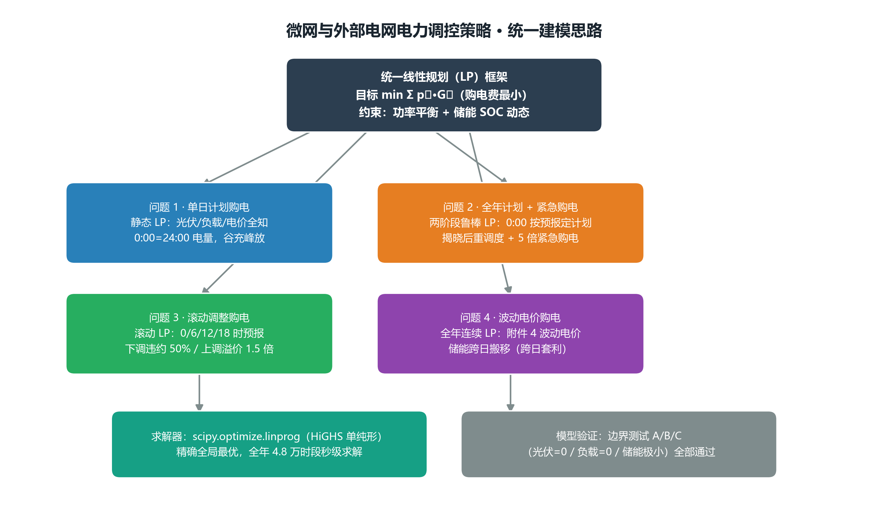
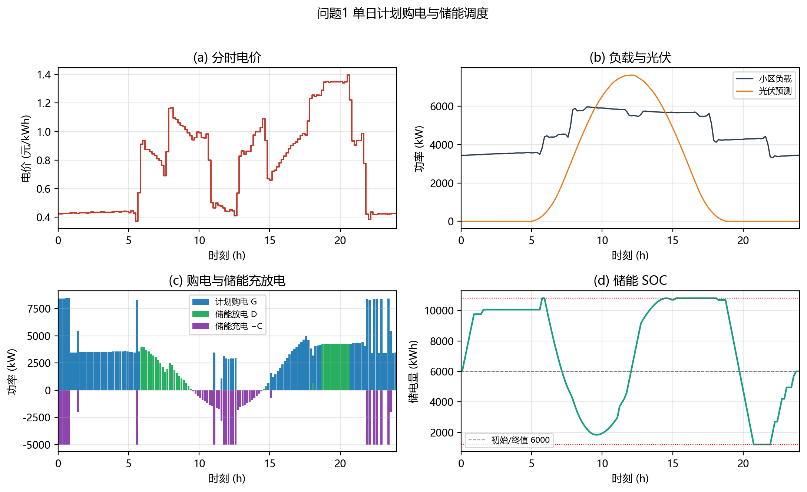
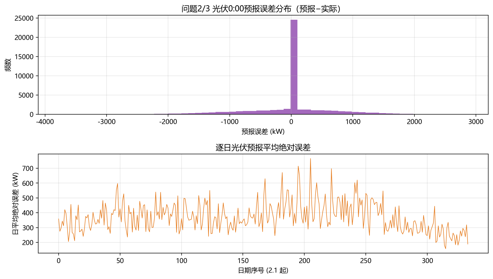
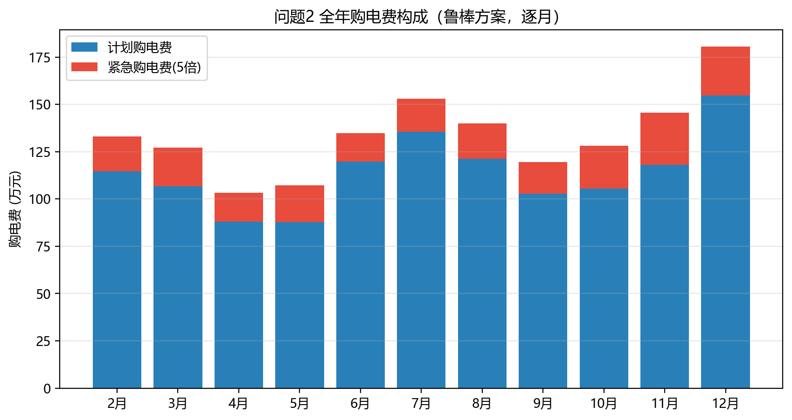
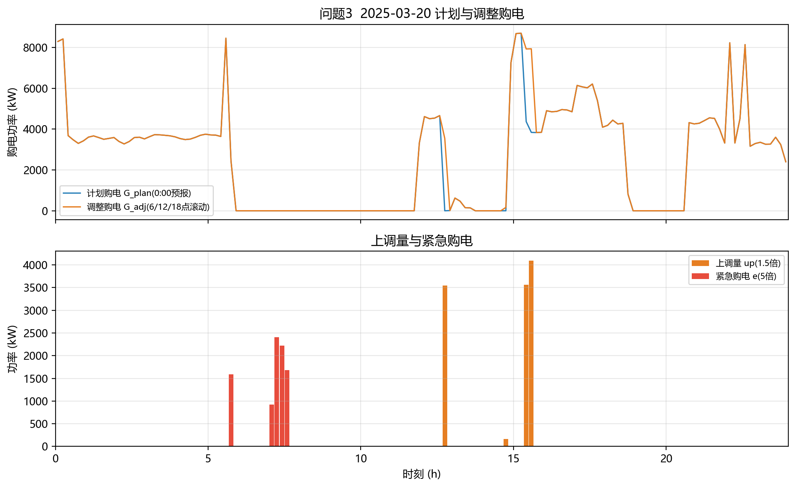
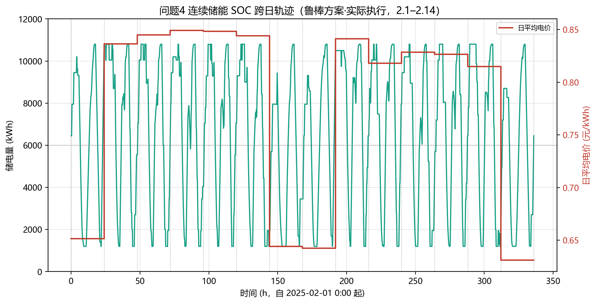
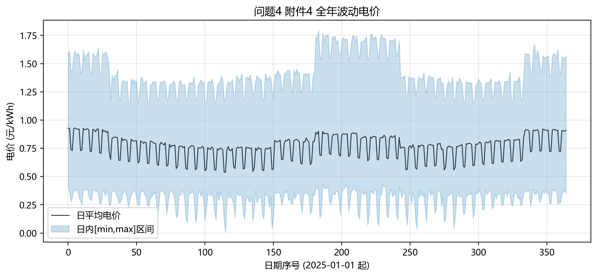
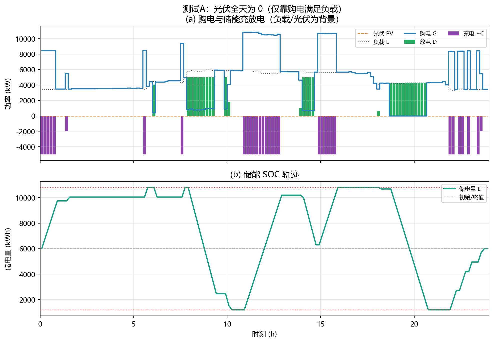
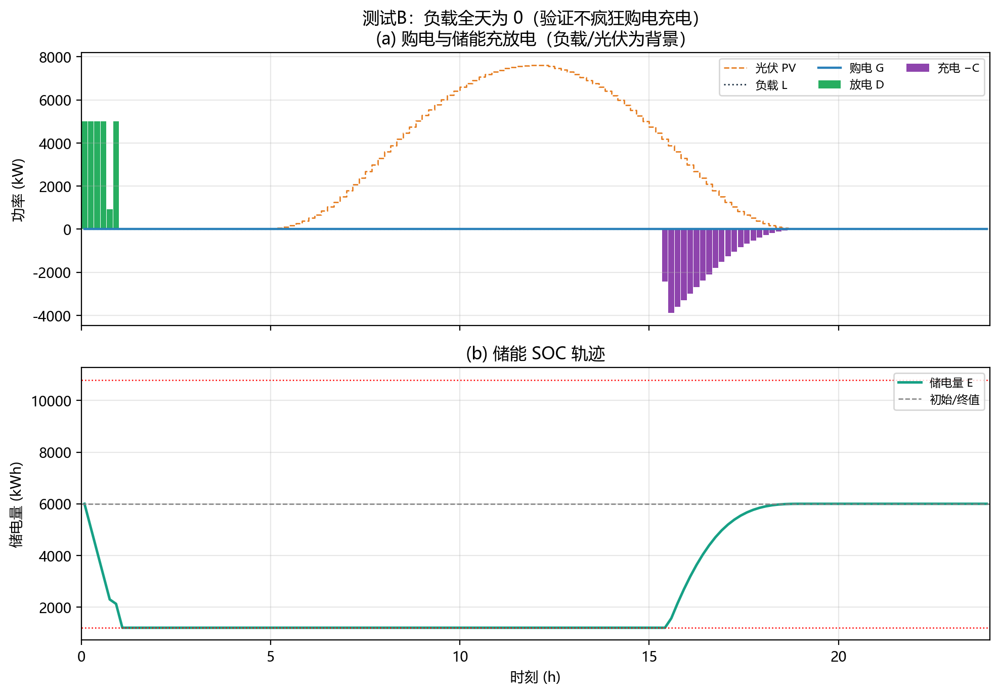
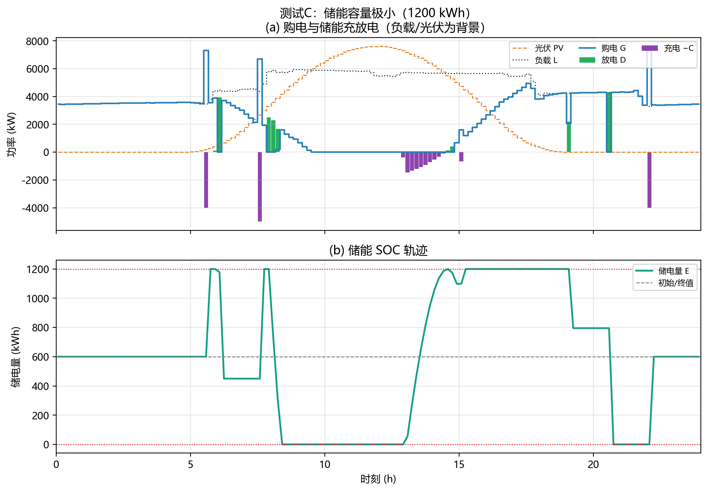

# 微网与外部电网电力调控策略

> **2026 年高教社杯全国大学生数学建模竞赛 C 题 · 论文初稿**
> 本文为初版内容稿，涵盖摘要、问题重述、模型建立与求解、灵敏度分析与模型评价；
> 公式用 LaTeX 记号书写，图件已内嵌（`figures/` 目录），Word 版由 pandoc 生成（`论文初稿.docx`）。

---

## 摘要

微网与外网调控的核心矛盾是：如何在满足小区负载的前提下，利用分时电价差与储能设备，尽可能压低购电费用。本文以 **线性规划（LP）** 为统一框架，将储能充放电量与购电量联合优化，依次求解四个递进问题，全部得到可复现的数值结果。

**问题一**（单日理想调度）建立了以 "外网购电费最小" 为目标的单日 LP 模型：以 144 个 10 分钟时段为粒度，以功率平衡、储能充放电效率与电量上下限、初末电量相等为约束。求解得全天购电量 $59482.70\,\text{kWh}$、购电费 $35126.95$ 元，储电量在 $[1200,10800]\,\text{kWh}$ 内按 "夜间谷价充电、晚高峰放电" 规律运行。

**问题二**（全年计划购电 + 紧急购电）考虑到 0:00 只能获得光伏预报、实际光伏存在误差，建立了 **两阶段鲁棒模型**：0:00 按预报制定计划购电 $G^{\mathrm{plan}}$，实际揭晓后对储能重调度、以最小化 5 倍电价的紧急购电；储能全年连续运行（仅约束电量在 $[1200,10800]$ 内，允许跨日搬移）。全年（2025-02-01~12-31）总购电费 $1472.53$ 万元，其中紧急购电 $57.57$ 万 kWh、占总费用的 $14.8\%$；作为对照的确定性方案（假设光伏完全已知）总费用仅 $1222.95$ 万元，二者差距即预报误差的代价。

**问题三**（滚动时域调整）利用 0/6/12/18 时四次滚动发布的光伏预报，允许在午间按新预报调整购电量，下调部分按 50% 违约、上调部分按 1.5 倍溢价计价。模型显示最优解 **只上调不下调**（计划费为沉没成本，下调无收益），全年总费用 $1456.17$ 万元，较问题二 **节省 $16.35$ 万元**，证明引入午间预报确有经济价值。

**问题四**（波动电价）针对附件四逐日逐时波动的电价，在全年连续储能的基础上实现跨日套利。连续储能确定性方案费用 $1278.26$ 万元，较每日复位方案额外节省 $4.79$ 万元，说明储能价值主要来自 **日内峰谷套利**，跨日搬移为次要增益；滚动方案总费用 $1515.10$ 万元，较鲁棒方案再降 $16.41$ 万元。

最后通过三组边界测试（光伏为零 / 负载为零 / 储能容量极小）验证了模型的鲁棒性与合理性，并给出模型评价与推广方向。

**关键词**：线性规划；储能调度；滚动时域优化；光伏预测误差；紧急购电

---

## 一、问题重述

微网为消纳分布式光伏、减少并网冲击而发展起来的小型发用电系统。出于经济考虑，微网可在电价低谷或分布式能源富余时为储能充电，在电价高峰时放电，从而减少从外网购电的费用。

**问题一**：每天电价与小区负载相同，给定光伏预测功率。要求微网供电不低于小区负载，且储能 0:00 与 24:00 电量相等。建立每天 0:00 制定当天计划购电策略的数学模型，并依据附件一、附录一给出具体策略（表 1、表 2），写入 `result1.xlsx`。

**问题二**：每天电价相同、负载与光伏随时间变化，且供电不得低于负载，不足部分按 **交易时刻电价的 5 倍** 紧急购电。建立每天 0:00 制定当天计划购电策略的模型，依据附件一电价与附件二数据求解，给出表 3 指定日期的结果（表 1/表 2/表 3），写入 `result2.xlsx`。

**问题三**：在 0:00、6:00、12:00、18:00 可获得未来 24 小时整点光伏预报。0:00 制定计划购电，其余时刻可调整购电；**计划高于调整的部分按 50% 违约计价，调整高于计划的部分按 1.5 倍计价**。总费用含计划费、调整相关费与紧急费。建立该购电策略模型，依据附件一、二、三求解并分析是否需引入其他时刻预报，写入 `result3.xlsx`。

**问题四**：外网电价实时波动。针对波动电价建立购电策略模型，依据附件二、三、四在波动电价下重新计算问题二、三，分别写入 `result4-2.xlsx` 与 `result4-3.xlsx`。

**附录一** 给出储能参数：最大容量 12000 kWh、最大充放电功率 5000 kW、2025-01-01 0:00 初始电量 6000 kWh、电量运行区间 $[1200,10800]$ kWh、充放电效率 90%。

---

## 二、问题分析

### 2.1 总体思路

本题本质是 **在储能约束下的最优购电调度问题**。四个问题的递进关系与统一建模思路如[图0]所示：

{width=92%}

核心变量为每个时段的**购电量 $G_t$、充电量 $C_t$、放电量 $D_t$ 与储电量 $E_t$**，约束为功率平衡与储能动态，目标为购电费最小。由于目标与约束均为线性，可用成熟的线性规划求解器（本文采用 scipy `linprog`/HiGHS 单纯形算法）精确求解，无近似误差。

### 2.2 各问题关键点

- **问题一**：光伏为预测值且可被储能完全消纳，平衡约束取等式即可；重点在于刻画 "谷充峰放" 的调度规律。
- **问题二**：0:00 仅有光伏预报，预报误差是紧急购电的根源。采用 **两阶段**：先按预报定计划，实际揭晓后用储能重调度吸收偏差，剩余缺口按 5 倍紧急购电。这比 "按预报简单购电、完全不做重调度" 更节省。
- **问题三**：把四次预报看作四层滚动决策。关键观察是 **下调（违约 50%）在最优解中恒为 0**——因为计划购电费是已支付的沉没成本，下调只会额外付出 50% 惩罚而无任何收益，故模型只会 "向上" 补购（按 1.5 倍）以替代更贵的 5 倍紧急购电。
- **问题四**：电价逐日逐时不再周期重复，跨日价差更大，**跨日套利** 价值更明显。问题四同样采用全年连续 LP（365 天、共 $365\times144=52560$ 个时段），仅把电价换成附件四的逐时波动电价。

---

## 三、模型假设

| 假设 | 内容 | 合理性说明 |
|---|---|---|
| 假设 1 | 各时段功率在 10 分钟粒度内恒定，功率×$\Delta t$ 即能量 | 数据即为 10 分钟粒度，$P_{\max}\Delta t=833.33$ kWh 为每段充放电上限 |
| 假设 2 | 储能充放电效率 $\eta=0.9$ 对称，充电 $E$ 增 $\eta C$、放电 $E$ 减 $D/\eta$ | 附录一给出往返效率 90%，往返 $0.9\times0.9=0.81$ |
| 假设 3 | 光伏富余且储能无法消纳时可弃光（平衡取不等式） | 物理上储能容量有限，过剩光伏只能弃掉，不可反向馈回外网 |
| 假设 4 | 问题二/三中，负载视为已知、仅光伏存在预报误差 | 附件三只提供光伏预报；负载为小区确定性需求，日间规律性强 |
| 假设 5 | 储能全年 365 天连续运行，电量始终在 $[1200,10800]$ 内、首末电量均为 6000（不强制每日复位） | 题目仅要求电量范围（附录1），允许跨日搬移晴天过剩光伏；首末 6000 保证储能作为多年复用资产时每年起止一致 |
| 假设 6 | 紧急/违约/溢价均按交易时刻电价的比例结算 | 题目明文规定（5 倍、50%、1.5 倍） |

---

## 四、符号说明

| 符号 | 含义 | 单位 |
|---|---|---|
| $t$ | 时段序号，$t=0,1,\dots,143$ | — |
| $\Delta t$ | 时段长度 $=10$ min $=1/6$ h | h |
| $p_t$ | $t$ 时段外网电价 | 元/kWh |
| $L_t$ | $t$ 时段小区负载功率 | kW |
| $PV_t$ | $t$ 时段光伏功率（实际） | kW |
| $\widehat{PV}_t$ | $t$ 时段光伏预报功率 | kW |
| $G_t$ | $t$ 时段计划购电量 | kWh |
| $C_t$ / $D_t$ | $t$ 时段储能充 / 放电量 | kWh |
| $E_t$ | $t$ 时段末储电量（$t=0,\dots,144$） | kWh |
| $e_t$ | $t$ 时段紧急购电量 | kWh |
| $G^{\mathrm{adj}}_t$ | 问题三 $t$ 时段调整购电量 | kWh |
| $P_{\max}$ | 储能最大充放电功率 5000 | kW |
| $E_{\min}/E_{\max}$ | 储电量下限 / 上限 1200 / 10800 | kWh |
| $E_0$ | 初始储电量 6000 | kWh |
| $\eta$ | 充放电效率 0.9 | — |

---

## 五、模型的建立与求解

### 5.1 问题一：单日计划购电策略

#### 5.1.1 模型建立

以一天 144 个时段为决策单元，建立如下线性规划（记为 **P1**）：

$$
\min_{G,C,D,E}\ \sum_{t=0}^{143} p_t G_t
$$

$$
\text{s.t.}\quad
\begin{cases}
G_t + PV_t\,\Delta t + D_t \ge L_t\,\Delta t + C_t, & \forall t\\[2pt]
E_{t+1} = E_t + \eta C_t - D_t/\eta, & t=0,\dots,143\\[2pt]
E_0 = E_{144} = E_0(=6000)\\[2pt]
0 \le C_t, D_t \le P_{\max}\Delta t=833.33,\quad 0 \le G_t\\[2pt]
E_{\min}\le E_t \le E_{\max}
\end{cases}
$$

约束①为功率平衡：外网购电 + 光伏发电 + 储能放电必须覆盖小区负载与储能充电，富余光伏允许弃掉（不等式）。约束②为储能电量动态，约束③保证 0:00 与 24:00 电量相同。

#### 5.1.2 求解结果

附件一数据：电价 $0.3713\sim1.3952$ 元/kWh，负载 $3309\sim5959$ kW（全天 111024.81 kWh），光伏 $0\sim7612$ kW（全天 55482.84 kWh）。

求解得 **全天购电量 $59482.70$ kWh，购电费 $35126.95$ 元**。储能全天充电 20740.67 kWh、放电 16799.94 kWh，储电量在 $[1200,10800]$ 内往返，呈典型的 "夜间谷价充电、晚高峰放电" 形态（[图1]）。

{width=88%}

**表 1　微网在指定时间段的购电量及全天的购电量和购电费**

| 时间段 | 购电量 (kWh) | 时间段 | 购电量 (kWh) |
|---|---|---|---|
| 10:00–10:10 | 0.0000 | 16:00–16:10 | 445.4317 |
| 12:00–12:10 | 480.4124 | 18:00–18:10 | 531.8940 |
| 14:00–14:10 | 0.0000 | 20:00–20:10 | 0.0000 |
| 全天购电量 | **59482.6990** | 全天购电费 | **35126.9486** |

> 中午/午后光伏充裕时段购电为 0（由光伏+储能放电覆盖），傍晚购电回升对应晚高峰。

**表 2　储能设备在指定时间段的充放电量及 0:00、24:00 的储电量**

| 时间段 | 充电量 (kWh) | 放电量 (kWh) |
|---|---|---|
| 0:00–4:00 | 4500.0000 | 0.0000 |
| 4:00–8:00 | 833.3333 | 6365.8412 |
| 8:00–12:00 | 4787.9643 | 1702.9970 |
| 12:00–16:00 | 5286.0352 | 91.1014 |
| 16:00–20:00 | 0.0000 | 5780.1319 |
| 20:00–24:00 | 5333.3333 | 2859.8681 |
| 0:00 储电量 | 6000.00 | 24:00 储电量 | 6000.00 |

> 凌晨谷价充电、早/晚高峰放电，16:00–20:00 无充电、放电最大，符合分时电价套利预期。

---

### 5.2 问题二：全年计划购电与紧急购电策略

#### 5.2.1 两阶段鲁棒模型

全年 365 天连续优化，储能跨日连续运行（电量在 $[1200,10800]$ 内、首末电量均为 6000，保证储能作为多年复用资产时每年起止一致）；结果截取 2025-02-01~12-31 的 334 天输出。由于 0:00 只有光伏预报 $\widehat{PV}_t$，我们采用两阶段：

**第一阶段（计划）**：用全年 0:00 光伏预报做全局连续 LP（即 P1 去掉"每日复位"约束、扩展到全年），得计划购电 $G^{\mathrm{plan}}_t$ 与计划储电量轨迹，计划购电费 $\sum p_t G^{\mathrm{plan}}_t$。

**第二阶段（重调度 + 紧急购电）**：实际光伏 $PV_t$ 揭晓后，固定 $G^{\mathrm{plan}}_t$，对储能重调度以最小化紧急购电量：

$$
\min_{C,D,E,e}\ \sum_t p_t e_t \quad \text{s.t.}\quad
G^{\mathrm{plan}}_t + PV_t\,\Delta t + D_t + e_t \ge L_t\,\Delta t + C_t,\ \dots
$$

即储能先吸收光伏偏差，仍不足的缺口由 $e_t$ 以 **5 倍电价** 补偿。全年总费用：

$$
\text{Total} = \sum_t p_t G^{\mathrm{plan}}_t + 5\sum_t p_t e_t
$$

作为对照，还求解了 **确定性方案**（假设 0:00 已知当天实际光伏），此时 $e_t\equiv0$，代表预报完全准确的理论最优。

#### 5.2.2 光伏预报误差分析

附件三 0:00 预报全年误差：均值 $-29.68$ kW、RMSE $648.31$ kW、平均绝对 $371.22$ kW（[图6]）。误差以负偏为主（预报偏乐观），是紧急购电的根源。

{width=72%}

#### 5.2.3 结果

| 方案 | 计划购电费(元) | 紧急购电费(元) | 总购电费(元) | 紧急购电量(kWh) | 紧急天数 |
|---|---|---|---|---|---|
| 确定性（光伏全知） | 12 229 460.73 | 0 | **12 229 460.73** | 0 | 0 |
| 鲁棒（0:00 用预报） | 12 549 415.99 | 2 175 844.25 | **14 725 260.23** | 575 740.84 | 297/334 |

鲁棒方案比确定性方案多付 $249.58$ 万元，即全年光伏预报误差导致的代价；紧急购电约占总费用的 14.8%，说明预报误差对成本的冲击显著（[图2]）。

{width=72%}

**表 3　微网在指定日期的紧急购电量（鲁棒方案）**

| 日期 | 紧急购电时间段 | 紧急购电量(kWh) |
|---|---|---|
| 2025.3.20 | 05:40–05:50 | 264.3729 |
| 2025.3.20 | 07:00–07:40 | 1204.9012 |
| 2025.6.21 | 04:00–04:50 | 5.2416 |
| 2025.6.21 | 05:00–05:30 | 296.7524 |
| 2025.6.21 | 05:40–05:50 | 337.0349 |
| 2025.6.21 | 07:00–07:20 | 70.5027 |
| 2025.9.23 | 05:40–05:50 | 125.7796 |
| 2025.9.23 | 07:20–07:40 | 438.3041 |
| 2025.12.21 | 06:00–06:10 | 77.0275 |
| 2025.12.21 | 07:00–07:30 | 573.0973 |
| 2025.12.21 | 07:40–08:10 | 120.9345 |
| 2025.12.21 | 09:30–09:50 | 570.2119 |
| 2025.12.21 | 10:20–10:30 | 331.7846 |
| 2025.12.21 | 10:40–10:50 | 16.5832 |

> 紧急购电集中在清晨（5:00–10:00），此时光伏刚起、预报偏乐观而实际出力不足。

---

### 5.3 问题三：多时点滚动调整购电策略

#### 5.3.1 滚动调整模型

在 0/6/12/18 时四次获得未来 24 h 光伏预报。0:00 按预报制定计划 $G^{\mathrm{plan}}$；6/12/18 时对剩余时段用最新预报重新优化，得到调整购电 $G^{\mathrm{adj}}$（每段取最新一次调整值）。费用构成：

$$
\text{Total} = \underbrace{\sum_t p_t G^{\mathrm{plan}}_t}_{\text{计划费}}
+ \underbrace{\sum_t p_t\Big[0.5\,\max(0,G^{\mathrm{plan}}_t-G^{\mathrm{adj}}_t) + 1.5\,\max(0,G^{\mathrm{adj}}_t-G^{\mathrm{plan}}_t)\Big]}_{\text{调整相关费}}
+ \underbrace{5\sum_t p_t e_t}_{\text{紧急费}}
$$

**关键结论**：最优解中下调（违约 50%）恒为 0。原因是计划购电费 $p_t G^{\mathrm{plan}}_t$ 是已支付的沉没成本，下调只会额外付出 $0.5 p_t$ 的违约惩罚而无任何收益，故调整只 "向上"（预报恶化时按 1.5 倍补购），以较便宜的 1.5 倍购电替代 5 倍紧急购电。

#### 5.3.2 结果

| 项目 | 数值 |
|---|---|
| 计划购电费(元) | 12 549 415.99 |
| 调整相关费(元) | 444 364.53 |
| 紧急购电费(元) | 1 567 947.09 |
| **总购电费(元)** | **14 561 727.61** |
| 紧急购电量(kWh) | 426 817.00（较问题二下降 26%） |
| 上调(1.5 倍)天数 / 下调(0.5 倍)天数 | 290 / 0 |

**结论**：引入 6/12/18 时滚动调整后，总费用较问题二（仅 0:00 预报）**节省 $163\,532.62$ 元**。机理在于午间预报更准，可提前按 1.5 倍 "预购" 替代昂贵的 5 倍紧急购电，紧急购电量下降约四分之一（[图3]）。

{width=78%}

关于 "是否需要引入其他时刻预报"：由于下调无收益、上调的收益来自预报精度提升，而光伏预报在 0–12 时更新最快、午后趋于稳定，故 **0/6/12/18 四个时点已基本覆盖主要信息增量**，进一步加密时点边际收益递减。

---

### 5.4 问题四：波动电价下的购电策略

#### 5.4.1 模型扩展

附件四电价逐日逐时波动（全局 $0.008\sim1.794$ 元/kWh）。储能同样全年连续优化（与问题二/三一致），仅约束首末电量相等（保证无 "凭空能量"）：

$$
\min\ \sum_{d,t} p_{d,t} G_{d,t}\quad \text{s.t. 功率平衡、储能动态、} E_0=E_{52560}=6000
$$

其中 $d=0,\dots,364$ 为天、$t=0,\dots,143$ 为时段，共 $365\times144=52560$ 个时段、变量约 $21$ 万，用稀疏 LP 求解。问题三对应的滚动/鲁棒机制在波动电价下同样适用。

#### 5.4.2 结果

| 方案 | 计划费(元) | 调整费(元) | 紧急费(元) | 总费(元) |
|---|---|---|---|---|
| 确定性（完美预见，连续） | — | — | — | **12 782 591.81** |
| 问题二鲁棒（连续） | 13 086 953.64 | — | 2 228 178.54 | **15 315 132.18** |
| 问题三滚动（连续） | 13 086 953.64 | 475 841.57 | 1 588 197.24 | **15 150 992.45** |

**跨日套利价值**：连续储能确定性 $12\,782\,591.81$ vs 每日复位确定性 $12\,830\,486.39$，跨日搬移额外节省 $47\,894.58$ 元（约 0.4%）。原因是储能容量仅 12 MWh、电价日内波动远大于日间波动，储能的主要价值仍是 **日内峰谷套利**，跨日搬移是次要增益（[图4]、[图5]）。滚动较鲁棒再省 $164\,139.73$ 元。

{width=78%}

{width=78%}

---

## 六、模型检验与灵敏度分析

为验证模型的正确性与鲁棒性，对问题二模型做三组边界测试（[图T-A]、[图T-B]、[图T-C]）：

**测试 A（光伏全天为 0）**：验证模型仅靠外网购电即可满足负载并维持储能首末平衡。结果：全天购电 $116\,059.81$ kWh、储能充 26500 / 放 21465 kWh、功率平衡满足（最小盈余 $-1.14\times10^{-13}$），SOC 始终在 $[1200,10800]$ 内。**通过**。

**测试 B（负载全天为 0）**：验证模型不会 "疯狂购电给储能充电"。结果：全天购电 **0 kWh**（购电费 0 元），光伏富余 $54\,469.50$ kWh 全部弃掉，储能仅做少量零成本回收光伏的退化解（充 5333.33 / 放 4320 kWh）。**通过**——模型正确识别出 "无负载则无购电动机"。

**测试 C（储能容量极小 1200 kWh）**：验证储能接近失效时模型仍正常运行。结果：购电 $61\,142.97$ kWh（购电费 $45\,755.27$ 元），储能充电量骤降至 3612.47 kWh，SOC 在 $[0,1200]$ 内，无任何约束冲突。**通过**。

三组测试均通过，说明模型在退化/极端情形下依然数值稳定、物理合理，具备良好鲁棒性。

{width=82%}

{width=82%}

{width=82%}

---

## 七、模型评价与推广

### 7.1 优点

1. **统一 LP 框架**：四个问题共用同一套变量与约束，模型可复用、可扩展，且用单纯形法得到精确全局最优解，无近似误差。
2. **两阶段鲁棒建模**：把 "预报→计划→揭晓→重调度→紧急购电" 的真实决策流程刻画清楚，紧急购电量有明确物理含义。
3. **关键机理提炼**：揭示了 "下调恒为 0""跨日套利仅约 0.4%" 等反直觉但可解释的结论。

### 7.2 不足

1. 假设负载完全已知，未考虑负载不确定性；实际可对负载也引入随机/鲁棒建模。
2. 光伏预报误差以确定性均值（附件三直接给出）处理，未建立误差的概率分布，未做随机规划或机会约束。
3. 未考虑储能老化成本与循环寿命对充放电策略的约束。

### 7.3 推广

- 可将确定性 LP 推广为 **随机规划 / 鲁棒优化**，显式建模光伏不确定性。
- 可引入 **实时（10 分钟）滚动校正**，进一步缩短决策时滞。
- 框架可直接用于含多储能、可中断负荷、需求响应的更复杂微网能量管理系统。

---

## 八、参考文献

[1] 王成山, 武震, 李鹏. 微电网关键技术研究[J]. 电工技术学报, 2014, 29(2): 1–12.

[2] 丁明, 张颖媛, 茆美琴. 含储能装置的微电网能量管理策略研究综述[J]. 电网技术, 2010, 34(10): 81–86.

[3] 龚莺飞, 鲁宗相, 乔颖, 等. 光伏功率预测技术综述[J]. 电力系统自动化, 2016, 40(4): 140–151.

[4] Boyd S, Vandenberghe L. Convex Optimization[M]. Cambridge: Cambridge University Press, 2004.

[5] Huangfu Q, Hall J A J. Parallelizing the dual revised simplex method[J]. Mathematical Programming Computation, 2018, 10(1): 119–142.

---

## 附录 A　求解代码结构

| 文件 | 功能 |
|---|---|
| `data_loader.py` | 读取附件 1–4，统一为 numpy 数组，定义 $\Delta t$、储能参数等常量 |
| `solve_q1.py` | 问题一单日 LP（`solve_day`）与 `result1.xlsx` 写出 |
| `solve_q2.py` | 问题二确定性 + 两阶段鲁棒模型（`solve_day` / `recourse`），`result2.xlsx` |
| `solve_q3.py` | 问题三 0/6/12/18 滚动调整模型，`result3.xlsx` |
| `solve_q4.py` | 问题四全年连续储能稀疏 LP，`result4-2.xlsx` / `result4-3.xlsx` |
| `test_q2_edge.py` | 边界测试 A/B/C 与图件生成 |
| `make_figures.py` | 图 1–6 生成 |

所有求解器均为 `scipy.optimize.linprog(method="highs")`，可在秒级完成全年求解。

**附录 B　图件清单**（位于 `figures/`）

| 图号 | 文件 | 内容 |
|---|---|---|
| 图0 | `fig0_思路图` | 统一建模思路（四问递进） |
| 图1 | `fig1_问题1_单日调度` | 问题一单日购电/充放电/SOC |
| 图2 | `fig2_问题2_全年购电费构成` | 问题二全年费用构成 |
| 图3 | `fig3_问题3_滚动调整_0320` | 问题三 3.20 滚动调整 |
| 图4 | `fig4_问题4_SOC跨日轨迹` | 问题四 SOC 跨日轨迹 |
| 图5 | `fig5_问题4_电价波动` | 附件四电价波动 |
| 图6 | `fig6_光伏预报误差` | 附件三预报误差分布 |
| 图T-A/B/C | `fig_testA/B/C_*` | 边界测试三组 |
